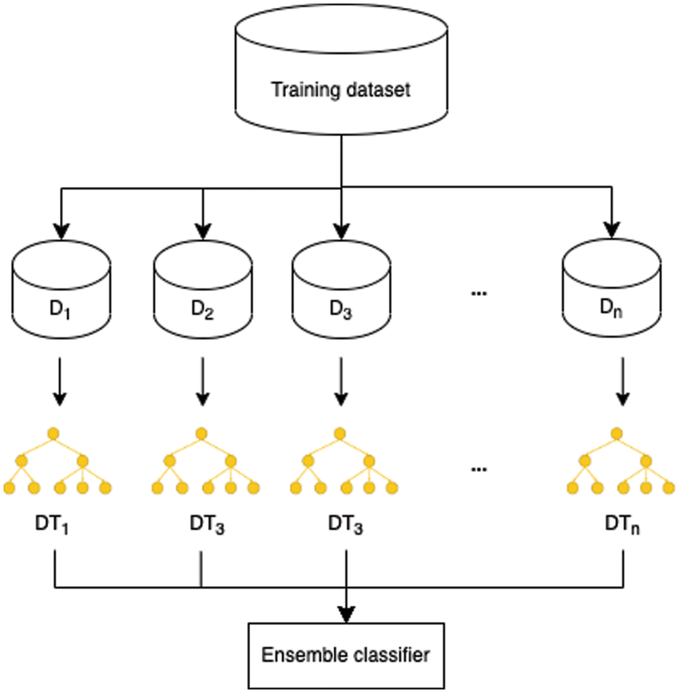

# Day 089 | Bagging Ensemble | Classifier

## Tips For Bagging
1. `Bagging` generally gives better result than `Pasting`
2. Good results come around the 25% to 50% row sampling mark
3. `Random patches` and `Subspaces` should be used while dealing with high dimensional data
4. To find the correct hyperparameter values we can do `GridSearchCV`/`RandomSearchCV`


## Code
> Python
```python

class sklearn.ensemble.BaggingClassifier(
    estimator=None, n_estimators=10, *, max_samples=1.0,
    max_features=1.0, bootstrap=True bootstrap_features=False, 
    oob_score=False, warm_start=False, n_jobs=None,
    random_state=None, verbose=0
)

```


## Images
