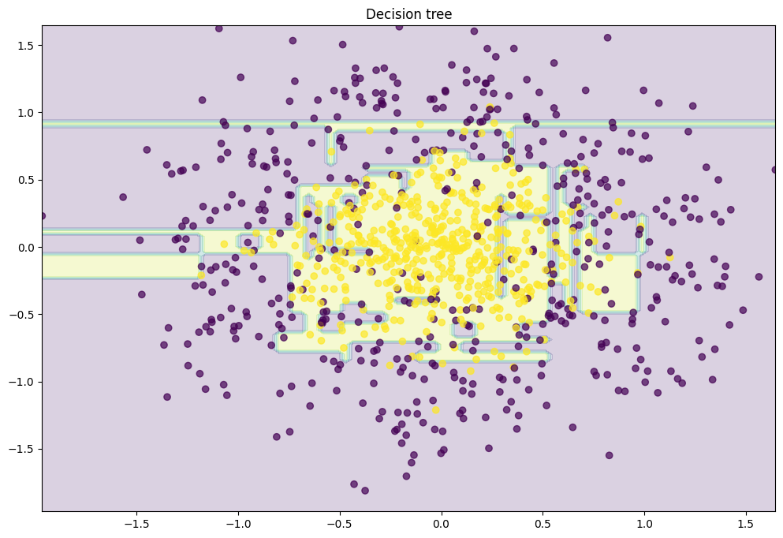
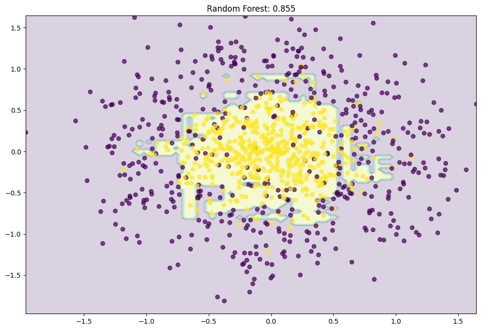
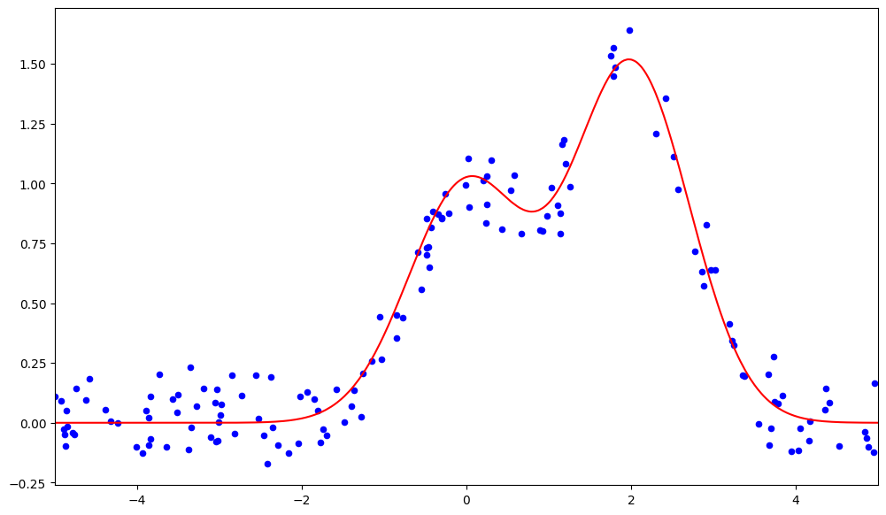
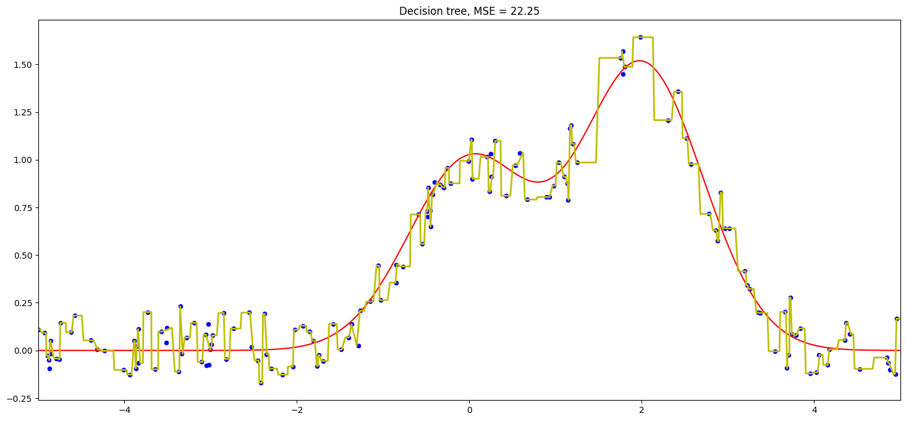
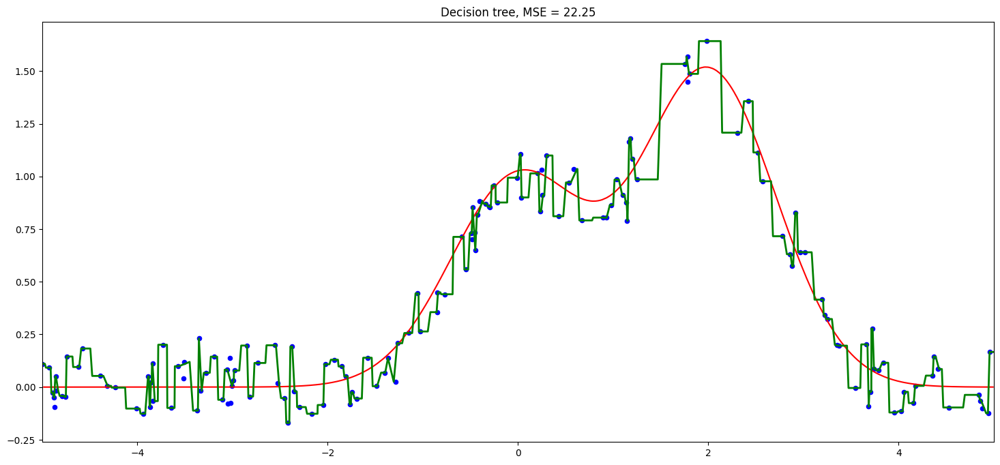
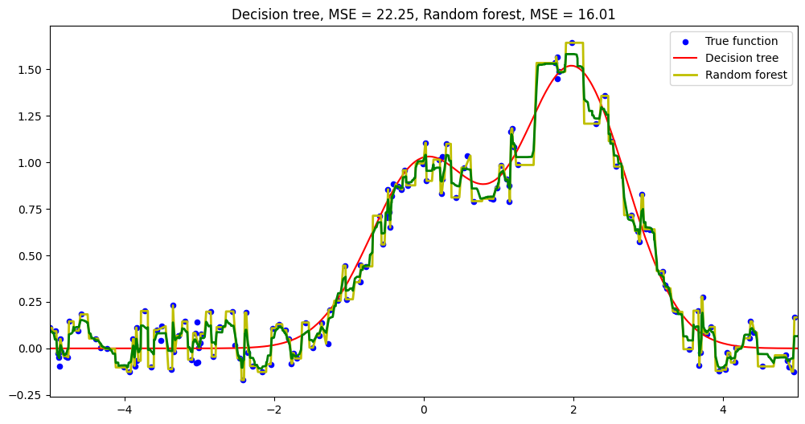

# Day 092 | Random Forest | Part 2 | How Random Forest So well ?

---

## Why Random Forest Performs So Well

**Random Forest** works well because it combines the strengths of many individual decision trees while overcoming their weaknesses. Here's why it performs so effectively:

1. **Reduces Overfitting**:
   Individual decision trees can easily overfit the training data. Random Forest averages the results from many trees, which **smooths out noise** and reduces variance, leading to better generalization.

2. **Randomness Creates Diversity**:
   By using both:

   * **Bootstrap sampling** (random subsets of data), and
   * **Random feature selection** at each split,
     Random Forest ensures that each tree is different. This **diversity** among the trees makes the ensemble less sensitive to any single noisy feature or data sample.

3. **Strong Learner from Weak Learners**:
   While each individual tree might be a "weak learner" (moderately accurate), combining many of them leads to a **strong learner** that performs better than most traditional algorithms.

4. **Works Well with High-Dimensional Data**:
   Since only a subset of features is considered at each split, Random Forest can handle datasets with **many features** efficiently and is less likely to be affected by irrelevant ones.

5. **Handles Missing and Unbalanced Data**:
   It is relatively robust to missing values and imbalanced datasets, especially when paired with additional techniques like class weighting or balanced sampling.

6. **Feature Importance**:
   Random Forest naturally provides **feature importance scores**, which help in understanding the model and performing feature selection.

---

## Images

