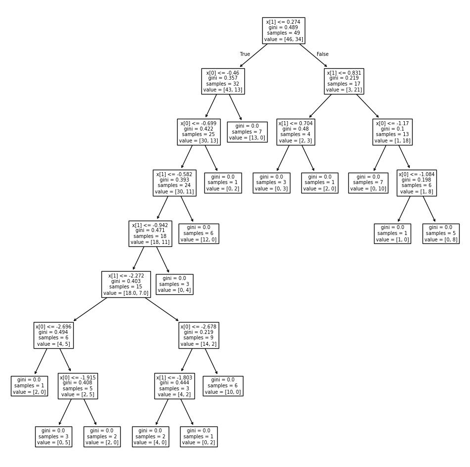
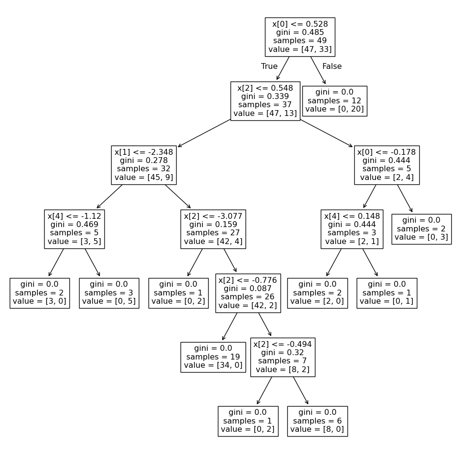

# Day 093 | Bagging Vs Random Forest

---

### Bagging vs. Random Forest

| Feature                       | **Bagging**                                    | **Random Forest**                                    |
| ----------------------------- | ---------------------------------------------- | ---------------------------------------------------- |
| **Full Name**                 | Bootstrap Aggregating                          | Random Forest                                        |
| **Type**                      | Ensemble technique                             | Ensemble of decision trees using bagging             |
| **Base Learners**             | Typically decision trees                       | Decision trees                                       |
| **Data Sampling**             | Bootstrap samples (with replacement)           | Bootstrap samples (same as bagging)                  |
| **Feature Selection**         | All features considered at each split          | **Random subset of features** at each split          |
| **Purpose of Feature Subset** | Not applicable                                 | To reduce correlation between trees                  |
| **Overfitting Risk**          | Lower than single trees, but can still overfit | Even **lower overfitting** due to feature randomness |
| **Model Variance**            | Reduced compared to individual models          | Reduced **even further**                             |
| **Interpretability**          | Easier than Random Forest                      | Less interpretable due to more randomness            |
| **Performance**               | Good improvement over single trees             | **Often better performance** than bagging            |
| **Feature Importance**        | Not naturally provided                         | **Provides feature importance**                      |

#### Summary:

* **Bagging** helps reduce variance by averaging over multiple models trained on bootstrapped datasets.
* **Random Forest** takes this further by also introducing **randomness in feature selection**, which **decorrelates the trees** and often results in **better generalization and accuracy**.

---

## Gemini
---
**Bagging** and **Random Forest** are both ensemble learning techniques based on the **Bagging** (Bootstrap Aggregating) method. They aim to improve the stability and accuracy of models by training multiple base learners on different subsets of the data and aggregating their predictions. However, they differ in a crucial aspect: **feature selection**.

Here's a breakdown of their key differences:

**Bagging (Bootstrap Aggregating):**

* **Data Sampling:** Creates multiple bootstrap samples (random subsets with replacement) from the original training data.
* **Base Learner Training:** Trains a base learner (e.g., Decision Tree, Logistic Regression, Neural Network) on each bootstrap sample **independently**.
* **Feature Consideration:** **Each base learner considers all the features** in the dataset when determining the best split at each node (if the base learner is a decision tree).
* **Goal:** Primarily aims to **reduce variance** and prevent overfitting.
* **Diversity:** Achieved mainly through the different data subsets used for training each base learner.

**Random Forest:**

* **Data Sampling:** Similar to Bagging, it creates multiple bootstrap samples from the original training data.
* **Base Learner Training:** Typically uses **Decision Trees** as the base learner for each bootstrap sample.
* **Feature Consideration:** **At each node of each decision tree, only a random subset of features is considered** for finding the best split. The size of this random subset is usually a hyperparameter (e.g., `sqrt(number of features)`).
* **Goal:** Aims to **reduce variance** further than simple bagging and also **reduce correlation** between the trees.
* **Diversity:** Achieved through both the different data subsets (bootstrapping) and the different subsets of features considered at each split. This makes the individual trees more independent of each other.

**Here's a table summarizing the key differences:**

| Feature           | Bagging                                  | Random Forest                             |
|-------------------|------------------------------------------|-------------------------------------------|
| **Base Learner** | Can be any type (e.g., Tree, LR, NN)     | Typically Decision Trees                |
| **Feature Selection at Split** | All features are considered            | Only a random subset of features is considered |
| **Tree Correlation** | Higher (trees can be more similar)       | Lower (trees are more independent)        |
| **Variance Reduction** | Primary goal                           | Significant goal                          |
| **Bias** | Can slightly increase bias              | May have a slightly higher bias than simple bagging in some cases due to the restricted feature selection, but often reduced overall error |
| **Interpretability**| Can be more interpretable with simpler base learners | Lower interpretability due to the random feature selection |
| **Complexity** | Generally simpler concept                | Adds the complexity of random feature selection |

**In essence:**

* **Bagging** focuses on training multiple models on different subsets of the data.
* **Random Forest** builds upon Bagging by also introducing randomness in the feature selection process during the training of each decision tree. This added randomness decorrelates the trees, often leading to better performance, especially on complex datasets.

**When to use which:**

* **Bagging:** Can be useful when you have a high-variance model and want to reduce overfitting. It's also more flexible as it can be used with various base learners.
* **Random Forest:** Often performs very well out-of-the-box, especially for tree-based models. It's a good general-purpose algorithm and is particularly effective when there are many correlated features.

While Random Forest is a type of bagging specifically designed for decision trees with random feature selection, the term "Bagging" is often used to refer to the more general technique with any base learner and without the random feature subspace step.

## Images
<!--  -->
---
<!--  -->

<figure>

  
  <figcaption><h2 align="center">Fig.1 - Decision Tree.</h2></figcaption>
  

</figure>

<figure>

  
  <figcaption><h2 align="center">Fig.2 - Random Forest.</h2></figcaption>
  

</figure>

<!-- [image](MyLovelyImage.png "some title") -->