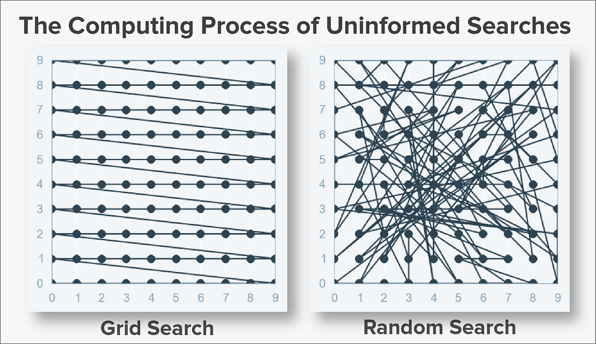

# Day 095 | Random Forest | HyperParameter Tunning

## Scikit Learn
> Python
```python
from sklearn.ensemble import RandomForestClassifier

rf = RandomForestClassifier(
    n_estimators=200,
    max_depth=15,
    max_features='sqrt',
    min_samples_split=4,
    min_samples_leaf=2,
    oob_score=True,
    random_state=42,
    n_jobs=-1
)
```

## Paraneter Tunning Using `GridSearchCV`
---

### GridSearchCV

**GridSearchCV** (Grid Search with Cross-Validation) is a hyperparameter tuning technique that systematically searches through a **manually specified set of hyperparameter combinations** to find the best model configuration based on a scoring metric.

It works by:

1. Defining a **grid of hyperparameter values** to test.
2. Performing **cross-validation** for each combination.
3. Selecting the set that gives the **best performance** (e.g., highest accuracy or lowest error).

### Why Use GridSearchCV?

* Automates model tuning
* Finds the optimal combination of hyperparameters
* Reduces human trial-and-error

### Example (Random Forest with GridSearchCV):

```python
from sklearn.model_selection import GridSearchCV
from sklearn.ensemble import RandomForestClassifier

# Define model
rf = RandomForestClassifier(random_state=42)

# Define parameter grid
param_grid = {
    'n_estimators': [100, 200],
    'max_depth': [10, 20, None],
    'min_samples_split': [2, 5],
    'max_features': ['sqrt', 'log2']
}

# Grid search with 5-fold cross-validation
grid_search = GridSearchCV(estimator=rf, param_grid=param_grid,
                           cv=5, scoring='accuracy', n_jobs=-1)

# Fit model
grid_search.fit(X_train, y_train)

# Best parameters and score
print("Best Parameters:", grid_search.best_params_)
print("Best Score:", grid_search.best_score_)
```

#### Key Parameters in GridSearchCV:

* `estimator`: the model to tune
* `param_grid`: dictionary of hyperparameters and values to test
* `cv`: number of cross-validation folds (default is 5)
* `scoring`: metric to optimize (e.g., `'accuracy'`, `'f1'`, `'neg_mean_squared_error'`)
* `n_jobs`: parallel processing (`-1` uses all cores)

---


## Paraneter Tunning Using `RandomizedSearchCV`
---

### RandomizedSearchCV

**RandomizedSearchCV** is a hyperparameter tuning technique that **randomly samples combinations** of hyperparameters from a specified distribution rather than trying every possible combination like GridSearchCV.

#### Why Use RandomizedSearchCV?

* **Faster and more efficient** than GridSearchCV when dealing with large hyperparameter spaces.
* Useful when you don’t have time/resources to exhaustively search every combination.
* Can still find near-optimal solutions with fewer iterations.

#### How It Works:

1. You define a **parameter distribution** (can be a list or statistical distribution).
2. You specify the **number of combinations** to try (`n_iter`).
3. It evaluates models using **cross-validation**, just like GridSearchCV.

#### Example (Random Forest with RandomizedSearchCV):

```python
from sklearn.model_selection import RandomizedSearchCV
from sklearn.ensemble import RandomForestClassifier
from scipy.stats import randint

# Define model
rf = RandomForestClassifier(random_state=42)

# Define parameter distributions
param_dist = {
    'n_estimators': randint(100, 500),
    'max_depth': [10, 20, None],
    'min_samples_split': randint(2, 10),
    'max_features': ['sqrt', 'log2']
}

# Random search with 20 iterations and 5-fold CV
random_search = RandomizedSearchCV(
    estimator=rf,
    param_distributions=param_dist,
    n_iter=20,
    cv=5,
    scoring='accuracy',
    random_state=42,
    n_jobs=-1
)

# Fit model
random_search.fit(X_train, y_train)

# Best parameters and score
print("Best Parameters:", random_search.best_params_)
print("Best Score:", random_search.best_score_)
```

#### Key Parameters:

* `param_distributions`: dictionary with lists or distributions of parameters
* `n_iter`: number of parameter combinations to try
* `cv`: number of cross-validation folds
* `scoring`: evaluation metric
* `random_state`: ensures reproducibility
* `n_jobs`: parallel processing

#### When to Use:

* Use **GridSearchCV** when the search space is small and exact optimization is needed.
* Use **RandomizedSearchCV** when the space is large or you need faster tuning.

---

## Images

