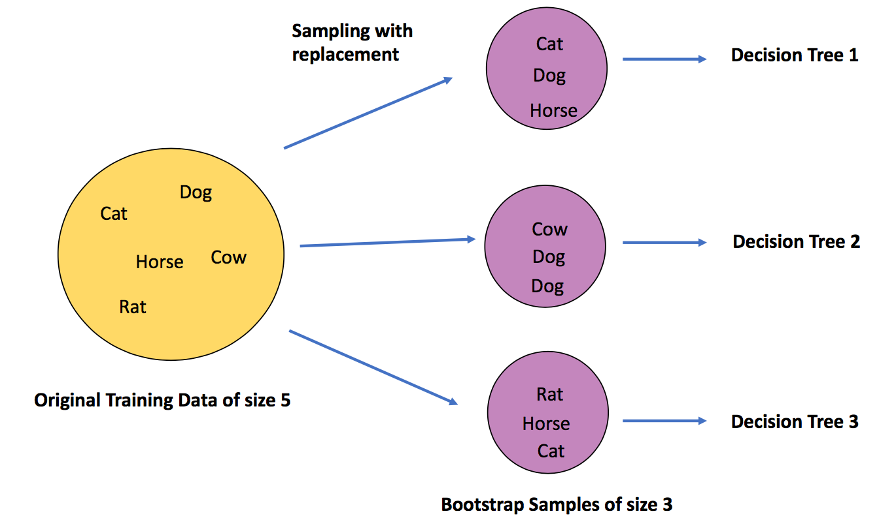

# Day 096 | OOB Score | Ensemble Problem

---

## OOB Score (Out-of-Bag Score)

The **OOB Score** is an internal validation method used in ensemble models like **Random Forest** when using **bootstrap sampling** (sampling with replacement).

### What Is It?

When building each tree in a Random Forest:

* Only a **random subset** of training data is used (due to bootstrapping).
* The remaining data (called **Out-of-Bag samples**) is **not used** to train that specific tree.
* These OOB samples can be used as a **validation set** to estimate the model's performance.

### Why It's Useful:

* Provides a **built-in cross-validation** method
* Saves time and computation (no need for separate train/test split)
* Offers a quick, unbiased estimate of generalization error

### How to Use in `scikit-learn`:
> Python
```python
from sklearn.ensemble import RandomForestClassifier

rf = RandomForestClassifier(
    n_estimators=100,
    oob_score=True,
    random_state=42
)

rf.fit(X_train, y_train)
print("OOB Score:", rf.oob_score_)
```

### Notes:

* OOB score is similar to test accuracy (for classification) or R² score (for regression).
* It only works when `bootstrap=True` (default setting).
* More trees generally give a more stable OOB estimate.

---

## Images
