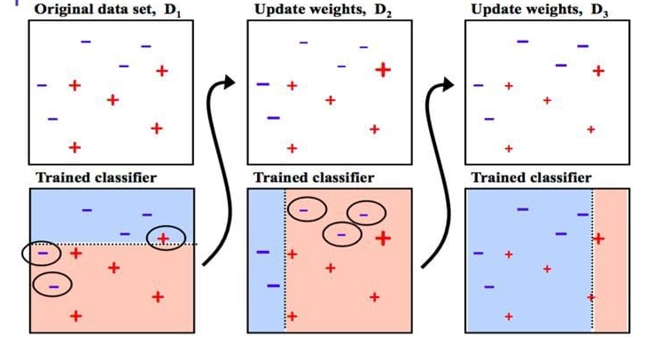

# Day 098 | AdaBoost Classifier Intuition | Part 1

---
## AdaBoost (Adaptive Boosting)

**AdaBoost**, short for **Adaptive Boosting**, is an ensemble learning technique that combines multiple **weak learners** (usually shallow decision trees) to create a **strong classifier**. It focuses on improving the performance of models by **giving more weight to misclassified examples** in each round.

---

### Prerequsit
1. Dept understand on Weak Learner (around 50%)
2. Decision Stumps
3. (+1, -1) concept in Decision Stumps

### How AdaBoost Works:

1. **Start** with all training samples having equal weights.
2. Train a **weak learner** (e.g., a decision stump) on the data.
3. **Increase weights** of misclassified samples so the next learner focuses more on them.
4. Repeat this process for a specified number of learners.
5. Combine the learners using a **weighted majority vote** (for classification) or **weighted average** (for regression).

---

### Key Concepts:

* Focuses on **hard examples** in later rounds.
* Each weak learner is assigned a **weight** based on its accuracy.
* Final prediction is a **weighted sum** of all learners.

---

### Example (scikit-learn):

```python
from sklearn.ensemble import AdaBoostClassifier
from sklearn.tree import DecisionTreeClassifier

# Use a shallow tree as the base estimator
base_estimator = DecisionTreeClassifier(max_depth=1)

# Create AdaBoost model
ada = AdaBoostClassifier(base_estimator=base_estimator, n_estimators=50, learning_rate=1.0, random_state=42)

# Train the model
ada.fit(X_train, y_train)
```

---

### Key Parameters:

* `n_estimators`: Number of weak learners (trees)
* `learning_rate`: Controls contribution of each learner (smaller = slower learning, more stable)
* `base_estimator`: The weak learner model (default: decision stump)

---

### Pros:

* Often improves accuracy significantly
* Robust to overfitting with proper tuning
* Works well with **imbalanced** data

### Cons:

* Sensitive to **noisy data** and **outliers**
* Sequential nature = **slower training** than bagging methods

---


## Gemini
## AdaBoost Classifier: Intuition

Imagine you're trying to teach someone to identify different types of birds. You show them a picture and they get it wrong. How do you help them learn?

**AdaBoost (Adaptive Boosting)'s core idea is to focus on the mistakes.** It works by sequentially training multiple "weak learners" (think of them as simple bird identification rules that are only slightly better than guessing) and giving more importance to the examples that were misclassified by the previous learners.

Here's a breakdown of the intuition:

**1. Start with Equal Focus:**

* Initially, AdaBoost gives equal weight to every bird picture (every data point). This means all examples are considered equally important in the first round of learning.

**2. Train a Weak Learner:**

* The first weak learner (e.g., a simple rule like "if it's small and yellow, it's a canary") tries to classify the birds. It will likely make some mistakes.

**3. Emphasize the Errors:**

* **The key step:** AdaBoost identifies the bird pictures that the first weak learner misclassified. It then **increases the weight** of these misclassified examples. This tells the next weak learner, "Hey, pay more attention to these tricky birds – the previous rule got them wrong!"

**4. Train Another Weak Learner (Focusing on the Hard Cases):**

* The second weak learner is now trained on the *same* set of bird pictures, but with the misclassified examples having higher importance. This forces the second learner to focus on getting those difficult cases right, even if it means making new mistakes on examples the first learner classified correctly.

**5. Give More Say to Better Learners:**

* AdaBoost also assigns a **weight to each weak learner** itself. Learners that perform better (make fewer errors on the weighted data) are given a higher weight in the final decision. This means their "opinion" carries more influence.

**6. Repeat the Process:**

* Steps 3-5 are repeated for a certain number of iterations. In each iteration:
    * The weights of the misclassified examples are increased.
    * A new weak learner is trained on the weighted data.
    * The weight of the new weak learner is determined based on its performance.

**7. Combine the Weak Learners (Weighted Vote):**

* Finally, when making a prediction for a new bird picture, AdaBoost combines the predictions of all the trained weak learners. Each learner's prediction is weighted according to its assigned performance weight.
* For classification, the class that receives the highest weighted vote is the final prediction.

**Analogy:**

Think of a group of students learning a difficult concept.

* **First student:** Makes some initial attempts and gets some parts wrong.
* **Teacher (AdaBoost):** Identifies the concepts the first student struggled with and emphasizes those areas more in the next lesson.
* **Second student:** Focuses more on the difficult parts, might still make some mistakes on easier parts.
* **Teacher:** Again, highlights the remaining errors.
* This continues with more students, each focusing on the mistakes of the previous ones.
* Finally, the combined understanding of all the students (with more weight given to those who showed better grasp) leads to a more accurate overall understanding.

**In essence, AdaBoost is like a team of specialists, where each specialist focuses on the areas where the previous ones struggled, and the opinions of the more skilled specialists are given more weight in the final decision.** It adaptively learns from the mistakes of the weak learners to build a strong overall classifier.

---

## Images
