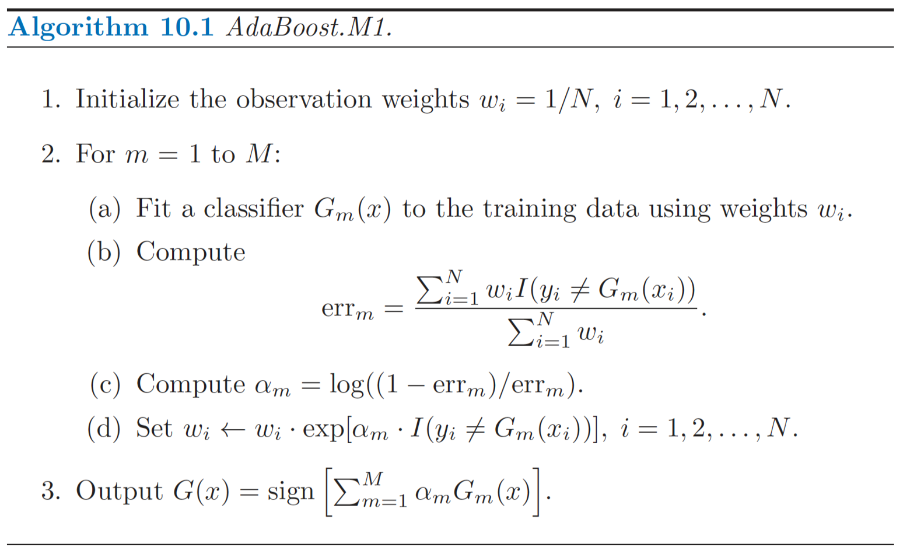

# Day 099 | AdaBoost Step by Step | Part 2

---

### 🌟 AdaBoost: Step-by-Step with Equations

Let’s consider **binary classification**, where labels $y_i \in \{-1, +1\}$, and we train $M$ weak learners.

---

### Step 1: Initialize Sample Weights

Assign equal weights to all training samples:

$$
w_i^{(1)} = \frac{1}{N}, \quad \text{for } i = 1, 2, \dots, N
$$

Where:

* $w_i^{(1)}$: weight of the $i$-th training sample in the 1st iteration
* $N$: total number of training samples

---

### Step 2: Train a Weak Learner

Train a weak learner $h_m(x)$ using the weighted data at iteration $m$.

---

### Step 3: Compute the Weighted Error

$$
\varepsilon_m = \frac{\sum_{i=1}^{N} w_i^{(m)} \cdot \mathbb{I}(y_i \neq h_m(x_i))}{\sum_{i=1}^{N} w_i^{(m)}}
$$

Where:

* $\mathbb{I}(y_i \neq h_m(x_i))$ is 1 if the prediction is wrong, else 0.
* $\varepsilon_m$: weighted classification error

---

### Step 4: Compute Learner Weight

$$
\alpha_m = \frac{1}{2} \ln\left(\frac{1 - \varepsilon_m}{\varepsilon_m}\right)
$$

* $\alpha_m$: the weight of the weak learner in the final model
* Learners with lower error get **higher weight**

---

### Step 5: Update Sample Weights

$$
w_i^{(m+1)} = w_i^{(m)} \cdot \exp(-\alpha_m y_i h_m(x_i))
$$

Then **normalize**:

$$
w_i^{(m+1)} \leftarrow \frac{w_i^{(m+1)}}{\sum_{j=1}^{N} w_j^{(m+1)}}
$$

* Misclassified samples get **increased weight**
* Correctly classified samples get **reduced weight**

---

### Step 6: Final Model

The final strong classifier is:

$$
H(x) = \text{sign} \left( \sum_{m=1}^{M} \alpha_m h_m(x) \right)
$$

* It combines the predictions of all weak learners, **weighted by their confidence**

---

### Summary of Parameters:

* $M$: Number of weak learners
* $\alpha_m$: Weight of each learner
* $w_i$: Sample weights updated at every round

---

## Images
