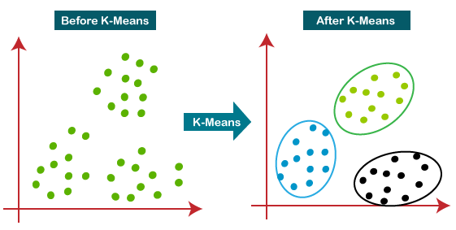
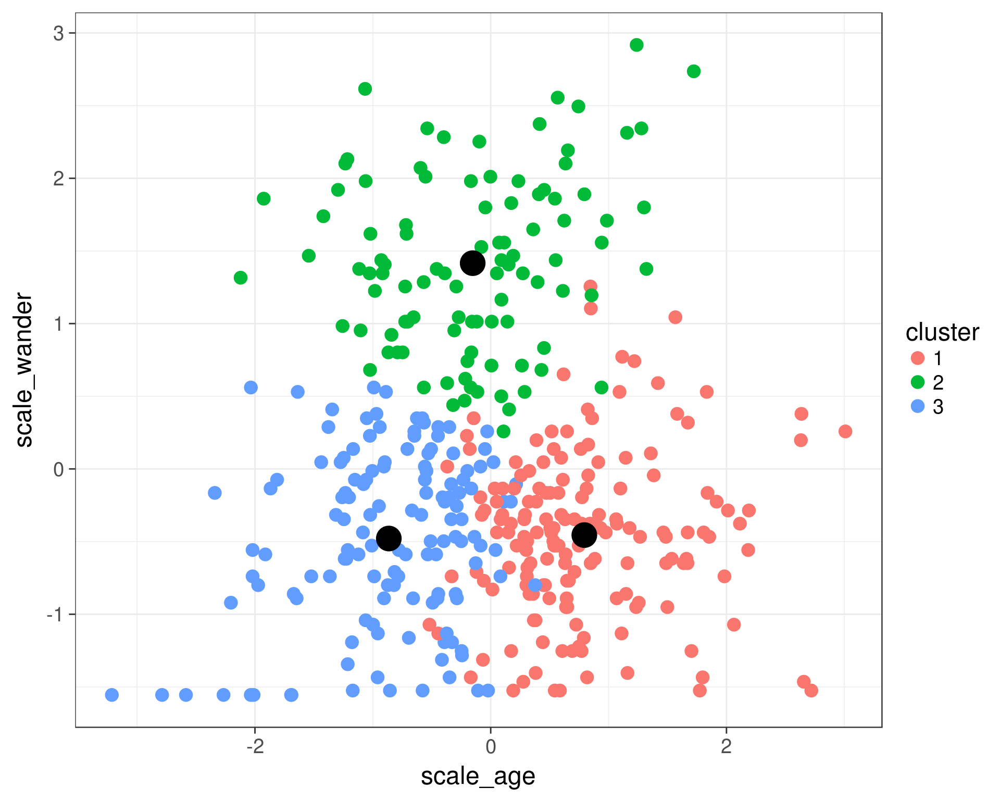

# Day 103 | K-Means Clustering | Geometric Intution
---

## 📍 K-Means Clustering

**K-Means Clustering** is an **unsupervised learning** algorithm used to group data into **K distinct clusters** based on similarity. It aims to **minimize the variance** within each cluster.

---

## 🧠 How It Works (Step-by-Step)

1. **Choose the number of clusters** $K$.
2. **Initialize** $K$ centroids randomly.
3. **Assign** each data point to the **nearest centroid** (using Euclidean distance).
4. **Update** centroids as the **mean** of all points in a cluster.
5. **Repeat** steps 3–4 until centroids don't change or max iterations are reached.

---

## 🎯 Objective Function

K-Means tries to minimize the **within-cluster sum of squares (WCSS)**:

$$
J = \sum_{i=1}^{K} \sum_{x \in C_i} \|x - \mu_i\|^2
$$

Where:

* $C_i$: the i-th cluster
* $\mu_i$: centroid of cluster $C_i$
* $x$: data point

---

## 🧪 Example in Python (`scikit-learn`)

```python
from sklearn.cluster import KMeans
import matplotlib.pyplot as plt
from sklearn.datasets import make_blobs

# Create sample data
X, _ = make_blobs(n_samples=300, centers=4, cluster_std=0.6, random_state=0)

# Fit KMeans
kmeans = KMeans(n_clusters=4, random_state=0)
kmeans.fit(X)

# Predict cluster labels
y_kmeans = kmeans.predict(X)

# Visualize clusters
plt.scatter(X[:, 0], X[:, 1], c=y_kmeans, cmap='viridis')
plt.scatter(kmeans.cluster_centers_[:, 0], kmeans.cluster_centers_[:, 1], 
            s=300, c='red', marker='X')  # centroids
plt.title("K-Means Clustering")
plt.show()
```

---

## ⚠️ Limitations

* Need to specify **K** manually.
* Sensitive to **initialization** and **outliers**.
* Assumes **spherical clusters** of similar size.

---

## ✅ Common Uses

* Customer segmentation
* Image compression
* Pattern recognition

---
---

### 📐 Elbow Method

The **Elbow Method** is a technique used to **determine the optimal number of clusters (K)** in K-Means clustering.

---

### 🧠 Idea Behind the Elbow Method

* As **K increases**, the **within-cluster sum of squares (WCSS)** decreases.
* However, after a certain point, the **improvement slows down** — forming an **“elbow” shape** in the curve.
* The **elbow point** is considered the **best value for K**, where adding more clusters doesn't improve the model significantly.

---

### 📊 WCSS (Inertia)

**WCSS** or **Inertia** is the total distance between each point and the centroid of its assigned cluster:

$$
\text{WCSS} = \sum_{i=1}^{K} \sum_{x \in C_i} \|x - \mu_i\|^2
$$

Where:

* $C_i$: i-th cluster
* $\mu_i$: centroid of cluster $C_i$

---

### 🧪 Python Example (Elbow Method)

```python
from sklearn.cluster import KMeans
from sklearn.datasets import make_blobs
import matplotlib.pyplot as plt

# Generate synthetic data
X, _ = make_blobs(n_samples=300, centers=4, random_state=42)

# Calculate WCSS for different K values
wcss = []
K_range = range(1, 11)
for k in K_range:
    kmeans = KMeans(n_clusters=k, random_state=42)
    kmeans.fit(X)
    wcss.append(kmeans.inertia_)

# Plot the elbow
plt.plot(K_range, wcss, 'bo-')
plt.xlabel('Number of clusters (K)')
plt.ylabel('WCSS (Inertia)')
plt.title('Elbow Method to Find Optimal K')
plt.grid(True)
plt.show()
```

---

### ✅ Summary

* Plot **K vs WCSS**.
* Look for the “elbow” where the rate of decrease sharply slows.
* This **optimal K** balances clustering quality and simplicity.

---


## Gemini

## K-Means Clustering: Notes

**Definition:** K-Means is an unsupervised learning algorithm that aims to partition $n$ observations into $k$ clusters, where each observation belongs to the cluster with the nearest mean (centroid). The goal is to minimize the within-cluster variance.

---

**Algorithm:**

1.  **Initialization:**
    * Choose the number of clusters, $k$.
    * Initialize $k$ centroids, often by randomly selecting $k$ data points from the dataset.
2.  **Assignment Step:**
    * Assign each data point to the cluster whose centroid is the closest, typically using Euclidean distance.
3.  **Update Step:**
    * Recalculate the centroids of each cluster by taking the mean of all the data points assigned to that cluster.
4.  **Iteration:**
    * Repeat the assignment and update steps until the centroids no longer change significantly or a maximum number of iterations is reached.

---

**Key Concepts:**

* **Centroid:** The mean of all data points within a cluster.
* **Inertia (Within-Cluster Sum of Squares - WCSS):** A metric that measures the sum of squared distances between each data point and its centroid. K-Means aims to minimize inertia.
* **Distance Metric:** Typically Euclidean distance is used, but other distance metrics can be employed.
* **Convergence:** The algorithm converges when the cluster assignments and centroids stabilize.

---

**Choosing the Number of Clusters (k):**

* **Elbow Method:** Plot the inertia for different values of $k$ and look for an "elbow" point where the rate of decrease in inertia sharply changes. This point is often a good estimate for the optimal $k$.
* **Silhouette Score:** Measures how well each data point fits into its cluster compared to other clusters. A higher silhouette score indicates better-defined clusters.

---

**Applications:**

* **Customer Segmentation:** Grouping customers based on purchasing behavior, demographics, etc., for targeted marketing.
* **Image Compression:** Reducing the number of colors in an image by clustering similar pixels.
* **Document Clustering:** Grouping similar documents based on their content.
* **Anomaly Detection:** Identifying outliers as data points that do not belong to any well-defined cluster.
* **Market Basket Analysis:** Identifying groups of products frequently bought together.

---

**Advantages:**

* **Simple and Easy to Understand:** The algorithm is conceptually straightforward and relatively easy to implement.
* **Scalable to Large Datasets:** K-Means has a linear time complexity with respect to the number of data points, making it efficient for large datasets.
* **Efficient Computation Cost:** Generally faster than other clustering algorithms.
* **Versatile:** Applicable across various domains.
* **Warm Start Possible:** Initial centroid positions can be guided if prior knowledge exists.

---

**Disadvantages:**

* **Requires Pre-specifying k:** The number of clusters ($k$) must be determined before running the algorithm, which can be challenging.
* **Sensitivity to Initial Centroids:** The final clustering can vary significantly depending on the initial random selection of centroids. Running the algorithm multiple times with different initializations is often recommended.
* **Assumes Spherical Clusters with Equal Variance:** K-Means performs poorly when clusters have non-spherical shapes, different sizes, or different densities.
* **Sensitivity to Outliers:** Outliers can significantly distort cluster centroids.
* **Not Suitable for Categorical Data Directly:** Requires conversion of categorical data into numerical representations.
* **Can Converge to Local Optima:** The algorithm is not guaranteed to find the global minimum of the inertia.

---

**Important Considerations:**

* **Data Preprocessing:** Scaling or normalizing the data is crucial to ensure that features with larger values do not dominate the distance calculations.
* **Handling Categorical Features:** Techniques like one-hot encoding can be used to convert categorical features to numerical.
* **Evaluating Cluster Quality:** Use metrics like inertia, silhouette score, or domain-specific knowledge to assess the quality of the resulting clusters.

In summary, K-Means clustering is a widely used and efficient algorithm for partitioning data into clusters based on their proximity to cluster centroids. While it has several advantages, it's important to be aware of its limitations and apply appropriate preprocessing and evaluation techniques.

---


## Images

