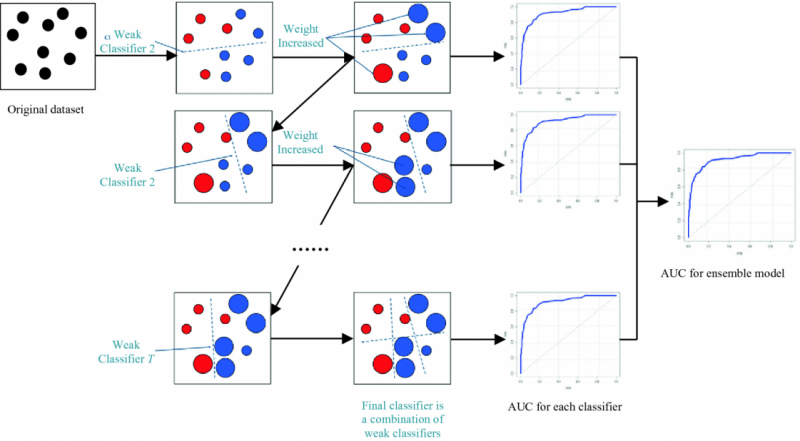

# Day 106 | Gradient Boosting | Introduction | Part 1

---

### 🌟 Gradient Boosting

**Gradient Boosting** is a powerful **ensemble learning** technique that builds models sequentially, each trying to correct the errors made by the previous one. It’s used for both **classification** and **regression** tasks.

---

### 🧠 Core Idea

Gradient Boosting combines multiple **weak learners** (typically decision trees) in a stage-wise manner. Unlike bagging, it focuses on examples that previous models handled poorly.

---

### ⚙️ How It Works (Step-by-Step)

1. **Initialize** a model (e.g., with the mean of the target values in regression).
2. **Compute residuals** (errors) from the current model.
3. **Fit a new tree** to the residuals.
4. **Add** this new tree to the overall model with a scaling factor (learning rate).
5. Repeat steps 2–4 for a fixed number of iterations or until convergence.

---

### 🧮 Loss Function

Gradient Boosting minimizes a differentiable loss function $L(y, \hat{y})$, such as:

* MSE for regression
* Log-loss for classification

Each new tree is trained on the **negative gradient** of the loss (hence the name “gradient boosting”).

---

### 📈 Prediction Formula

The final prediction is a sum of all weak learners:

$$
F(x) = F_0(x) + \sum_{m=1}^{M} \gamma_m h_m(x)
$$

Where:

* $F_0(x)$: initial prediction
* $h_m(x)$: m-th weak learner
* $\gamma_m$: learning rate
* $M$: number of boosting rounds

---

### ✅ Advantages

* Often **more accurate** than random forests.
* Works well with **non-linear data**.
* Supports **custom loss functions**.

---

### ⚠️ Disadvantages

* Slower to train than bagging methods.
* Sensitive to **overfitting** if not tuned properly.
* Needs **hyperparameter tuning** (learning rate, number of estimators, depth, etc.)

---

### 🧪 Python Example (Using `GradientBoostingRegressor`)

```python
from sklearn.ensemble import GradientBoostingRegressor
from sklearn.datasets import make_regression
from sklearn.model_selection import train_test_split
from sklearn.metrics import mean_squared_error

X, y = make_regression(n_samples=1000, n_features=10, noise=0.1, random_state=42)
X_train, X_test, y_train, y_test = train_test_split(X, y, test_size=0.2, random_state=42)

model = GradientBoostingRegressor(n_estimators=100, learning_rate=0.1, max_depth=3, random_state=42)
model.fit(X_train, y_train)
y_pred = model.predict(X_test)

print("MSE:", mean_squared_error(y_test, y_pred))
```

---

## Gemini

## Gradient Boosting: Notes

**Definition:** Gradient Boosting is a powerful ensemble learning algorithm that builds a strong predictive model by sequentially combining multiple weak learners, typically decision trees. Each new tree is trained to correct the errors made by the previous trees in the ensemble. It does this by focusing on the residuals (the differences between the actual values and the predictions) of the earlier models.

## Intuition:

Imagine you're trying to predict a student's final grade.

1.  **First Prediction (Weak Learner):** You might start with a simple rule, like predicting the average grade of all students. This will likely have some errors.
2.  **Focus on Errors (Residuals):** Gradient Boosting calculates the difference between the actual grades and your initial predictions (these are the residuals or errors).
3.  **Second Prediction (Weak Learner on Errors):** You then train a new, simple model (another rule, perhaps based on attendance) to predict these errors. The goal is to find patterns in *why* the initial predictions were wrong.
4.  **Combine Predictions:** The prediction of the second model is added to the prediction of the first model, aiming to reduce the overall error.
5.  **Repeat:** This process of calculating new residuals and training new weak learners to predict those residuals continues iteratively. Each new model focuses on the errors that the combined ensemble has made so far.
6.  **Weighted Combination:** The final prediction is a weighted sum of the predictions of all the weak learners. Learners that perform better in reducing the errors have a higher influence on the final prediction.

## Key Concepts:

* **Weak Learners:** Typically shallow decision trees (often called "stumps" with only one split) that perform slightly better than random guessing.
* **Sequential Training:** Models are built one after another, with each new model trying to correct the mistakes of the previous ones.
* **Loss Function:** A differentiable function that measures the difference between the predicted and actual values. The algorithm aims to minimize this loss function. Examples include Mean Squared Error (MSE) for regression and Log Loss (Cross-Entropy) for classification.
* **Gradient Descent:** The algorithm uses gradient descent in function space to find the optimal additive model. Each new weak learner's prediction is chosen to move the ensemble's prediction in the direction that reduces the gradient of the loss function.
* **Residuals (or Pseudo-Residuals):** The errors made by the current ensemble. In each iteration, the new weak learner tries to predict these residuals. For loss functions other than squared error, "pseudo-residuals" (based on the negative gradient of the loss function) are used.
* **Learning Rate (Shrinkage):** A parameter that scales the contribution of each new weak learner. A lower learning rate requires more trees but can lead to better generalization by preventing overfitting.

## Advantages:

* **High Predictive Accuracy:** Often achieves state-of-the-art results on various datasets.
* **Flexibility:** Can be used for both regression and classification tasks and can optimize for different loss functions.
* **Handles Mixed Data Types:** Can naturally handle both numerical and categorical features without extensive preprocessing in some implementations (e.g., LightGBM, CatBoost).
* **Feature Importance:** Provides estimates of feature importance.
* **Robust to Outliers (in some loss function choices):** Depending on the loss function used (e.g., Mean Absolute Error), it can be less sensitive to outliers than methods like Ordinary Least Squares.

## Disadvantages:

* **Computationally Expensive:** Training can be time-consuming, especially with a large number of trees and complex data.
* **Sensitive to Hyperparameter Tuning:** Performance heavily depends on careful tuning of parameters like the number of trees, learning rate, tree depth, etc.
* **Potential for Overfitting:** If not properly regularized (e.g., through limiting the number of trees, using a small learning rate, or pruning), it can overfit the training data, especially with noisy datasets.
* **Less Interpretable than Single Trees:** The final ensemble of many trees can be difficult to interpret directly.

## Popular Implementations:

* **XGBoost (Extreme Gradient Boosting):** Highly optimized and regularized implementation known for its speed and performance.
* **LightGBM (Light Gradient Boosting Machine):** Another fast and efficient implementation that uses techniques like Gradient-based One-Side Sampling (GOSS).
* **CatBoost:** Handles categorical features natively and offers robust performance.
* **scikit-learn's `GradientBoostingClassifier` and `GradientBoostingRegressor`:** Provides basic implementations in Python.

In summary, Gradient Boosting is a powerful technique that builds strong learners iteratively by focusing on correcting the errors of previous weak learners using a gradient descent approach. While it requires careful tuning and can be computationally intensive, its high predictive accuracy makes it a popular choice for many machine learning problems.


## Images



