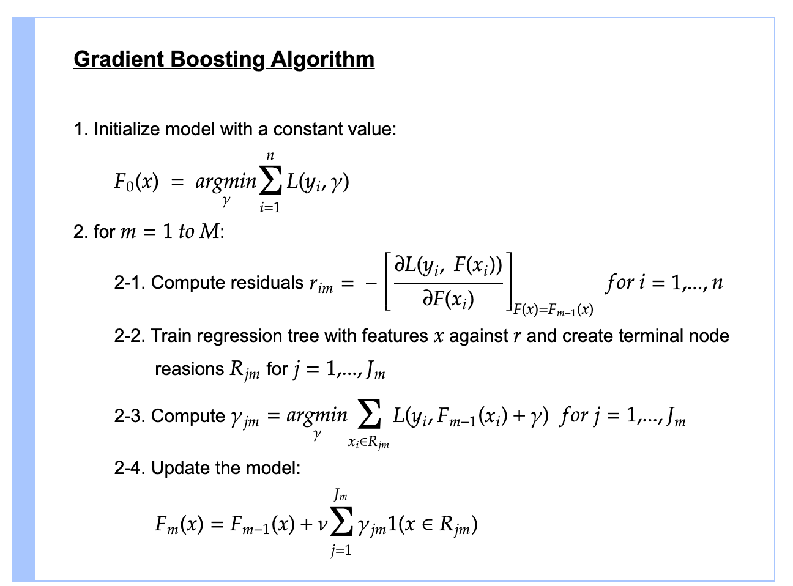

# Day 107 | Gradient Boosting Mathematics | Regression | Part 2

---

## 📘 Gradient Boosting: Mathematical Foundations

Gradient Boosting builds a **strong predictor** by combining many **weak learners** (usually decision trees), using a **gradient descent** strategy to minimize a loss function.

---

## 🎯 Goal

We want to minimize a general loss function $L(y, \hat{y})$ over training data $(x_i, y_i)$, where:

* $y_i$: true label
* $\hat{y}_i$: predicted value

The **final prediction model** is:

$$
F_M(x) = F_0(x) + \sum_{m=1}^{M} \gamma_m h_m(x)
$$

Where:

* $F_0(x)$: initial prediction (e.g., mean of target values)
* $h_m(x)$: weak learner fitted at stage $m$
* $\gamma_m$: step size (learning rate)

---

## 🔢 Step-by-Step Gradient Boosting Algorithm

### Step 1: Initialize the model

For regression:

$$
F_0(x) = \arg\min_{\gamma} \sum_{i=1}^{n} L(y_i, \gamma)
$$

Commonly, $F_0(x) = \bar{y}$ if using squared error loss.

---

### Step 2: For each boosting iteration $m = 1, 2, ..., M$

1. **Compute the negative gradient (residuals)**

$$
r_{im} = - \left[ \frac{\partial L(y_i, F(x_i))}{\partial F(x_i)} \right]_{F(x) = F_{m-1}(x)}
$$

These residuals are the targets for the next weak learner.

2. **Fit a weak learner** $h_m(x)$ to the residuals $r_{im}$:

$$
h_m(x) \approx r_{im}
$$

3. **Find optimal step size $\gamma_m$** (line search):

$$
\gamma_m = \arg\min_{\gamma} \sum_{i=1}^{n} L\left(y_i, F_{m-1}(x_i) + \gamma \cdot h_m(x_i)\right)
$$

4. **Update the model**:

$$
F_m(x) = F_{m-1}(x) + \gamma_m h_m(x)
$$

---

## 📉 Example: Squared Error Loss

If we use:

$$
L(y, \hat{y}) = \frac{1}{2}(y - \hat{y})^2
$$

Then the **negative gradient** is simply:

$$
r_{im} = y_i - F_{m-1}(x_i)
$$

Which is the residual — same as in standard regression trees.

---

## 💡 Intuition

At each step:

* You're fitting a new tree to **correct the errors** of the current model.
* You're **moving in the direction** of the **steepest descent** (gradient) of the loss function.

---

## 🔧 Custom Loss Function

The beauty of gradient boosting is that it works with **any differentiable loss function**, such as:

* Mean Squared Error
* Log Loss (binary classification)
* Poisson or Gamma (for count data)

---

## Images

