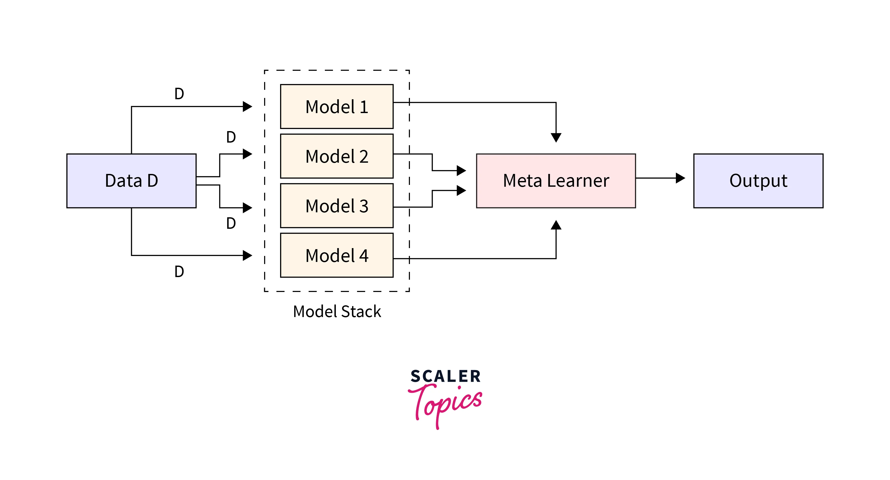
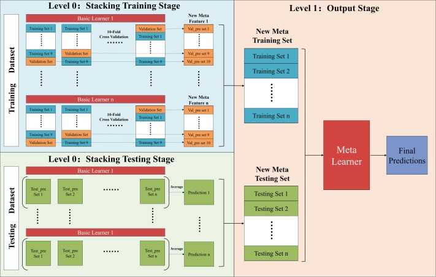

# Day 109 | Stacking and Blending | Hold on Method | K-Fold Method


---

## 🧠 Stacking vs Blending

Both **stacking** and **blending** are advanced ensemble learning techniques that combine predictions from multiple base models to improve overall performance. They work by **learning how to best combine model outputs** — but they differ in how the training data is handled.

---

## 🔷 Stacking (Stacked Generalization)

### 📌 What is Stacking?

Stacking combines multiple base learners (**level-0 models**) and uses another model (**meta-learner** or **level-1 model**) to learn how to combine their predictions.

---

### ⚙️ How Stacking Works

1. **Train base models** (e.g., Decision Tree, SVM, KNN) on training data.
2. **Generate predictions** from these models using **out-of-fold** predictions (to avoid overfitting).
3. Use the predictions as **input features** to train a **meta-model** (e.g., Logistic Regression, XGBoost).
4. In prediction time:

   * Base models predict on new data.
   * Meta-model uses those predictions to output the final result.

---

### ✅ Advantages of Stacking

* Very powerful if base models are diverse.
* Can reduce bias and variance.
* Meta-model can learn complex interactions among model outputs.

---

### ❌ Disadvantages

* Computationally expensive.
* More complex to implement.
* Needs careful handling of cross-validation to prevent data leakage.

---

### 🔢 Example (Scikit-learn):

```python
from sklearn.ensemble import StackingClassifier
from sklearn.linear_model import LogisticRegression
from sklearn.svm import SVC
from sklearn.tree import DecisionTreeClassifier

base_models = [
    ('svc', SVC(probability=True)),
    ('dt', DecisionTreeClassifier())
]

meta_model = LogisticRegression()

stacking_clf = StackingClassifier(estimators=base_models, final_estimator=meta_model, cv=5)
```

---

## 🔶 Blending

### 📌 What is Blending?

Blending is similar to stacking but **simpler** and usually faster. Instead of cross-validation, blending splits the data into:

* **Train set** for base models
* **Holdout set** (validation set) for the meta-model

---

### ⚙️ How Blending Works

1. Split training data into two parts: `train` and `val`.
2. Train base models on `train` set.
3. Get predictions from base models on `val` set.
4. Train meta-model on those predictions vs actual targets from `val`.
5. Predict on test data using base models, and pass those to the meta-model.

---

### ✅ Advantages

* Easier to implement than stacking.
* Less risk of data leakage.

---

### ❌ Disadvantages

* Wastes part of the training data (holdout set).
* Meta-model may underperform if holdout set is too small.

---

### 🔢 Quick Pseudocode

```python
# Split training data into train and holdout
# Train base models on train set
# Predict on holdout set → use as features for meta-model
# Train meta-model on holdout predictions
```

---

## 🔁 Summary Table

| Feature             | Stacking                       | Blending                         |
| ------------------- | ------------------------------ | -------------------------------- |
| Validation type     | Cross-validation (out-of-fold) | Holdout set                      |
| Data usage          | Uses full data efficiently     | Discards some data for holdout   |
| Implementation      | Complex                        | Simpler                          |
| Risk of overfitting | Low (if CV handled properly)   | Higher (if holdout is too small) |

---


## Gemini

---

## Stacking

**Definition:** Stacking, also known as Stacked Generalization, is an ensemble learning technique that combines the predictions of multiple base models (also called level-0 models) by training a new model (called the meta-model or level-1 model) on the outputs of the base models.

### Mechanism:

1.  **Base Models Training:** Several diverse base models are trained on the entire training dataset. These models can be of different types.
2.  **Base Model Predictions:** The trained base models make predictions on the training data. To avoid overfitting, these predictions are typically generated using cross-validation. For each data point in the training set, the prediction is made by a base model that was not trained on that specific fold.
3.  **Meta-Model Training Data:** The predictions from the base models become the input features for the meta-model. The target variable remains the same as the original training data.
4.  **Meta-Model Training:** The meta-model (e.g., Logistic Regression, Linear Regression, Neural Network) is trained on this new dataset of base model predictions to learn how to best combine the base model outputs.
5.  **Final Prediction:** For new, unseen data, the base models first make their predictions. These predictions are then fed as input to the trained meta-model, which outputs the final prediction.

### Key Aspects:

* **Heterogeneous Models:** Stacking often works well with diverse base models that capture different aspects of the data.
* **Cross-Validation:** Crucial in generating out-of-fold predictions for training the meta-model to prevent data leakage and overfitting.
* **Meta-Learner:** The choice of the meta-learner is important and should be suitable for learning the relationships between the base model predictions and the true target.

## Blending

**Definition:** Blending is another ensemble learning technique that is similar to stacking but uses a simpler approach for combining the base model predictions.

### Mechanism:

1.  **Data Splitting:** The training data is split into three sets: a training set, a validation set (hold-out set), and a test set.
2.  **Base Models Training:** Several diverse base models are trained *only* on the initial training set.
3.  **Base Model Predictions on Validation Set:** The trained base models make predictions on the validation set.
4.  **Meta-Model Training Data:** The predictions from the base models on the validation set, along with the true target values of the validation set, are used to train the meta-model.
5.  **Base Model Predictions on Test Set:** The trained base models also make predictions on the test set.
6.  **Final Prediction:** The predictions from the base models on the test set are fed as input to the trained meta-model to obtain the final predictions.

### Key Aspects:

* **Hold-Out Set:** Blending relies on a single split of the training data to create the validation set for training the meta-model.
* **Simpler than Stacking:** Avoids the need for extensive cross-validation in generating meta-model training data.
* **Potential Information Loss:** Since the meta-model is trained only on the validation set (a portion of the training data), it might not learn as comprehensively as in stacking.

## Stacking vs. Blending

| Feature             | Stacking                                     | Blending                                      |
| ------------------- | -------------------------------------------- | --------------------------------------------- |
| **Meta-Model Training Data** | Out-of-fold predictions via cross-validation | Predictions on a hold-out validation set      |
| **Data Splitting** | Typically K-fold cross-validation used       | Single train-validation-test split            |
| **Risk of Information Leakage** | Lower, due to cross-validation             | Higher, as meta-model trains on a subset of train data |
| **Computational Cost** | Higher, due to repeated training in CV       | Lower, as models are trained once             |
| **Complexity** | More complex to implement                     | Simpler to implement                          |
| **Potential Performance** | Generally higher potential accuracy        | Can be slightly lower accuracy in some cases |
| **Data Usage for Meta-Learner** | Uses predictions from the entire training set | Uses predictions from a smaller validation set |

## In Summary:

* Both stacking and blending aim to combine the strengths of multiple models.
* **Stacking** is generally considered more robust and can potentially achieve higher accuracy due to its use of cross-validation to generate the meta-model training data. However, it is more computationally expensive and complex.
* **Blending** is a simpler and faster alternative, but its performance might be slightly lower due to the smaller dataset used for training the meta-model.

The choice between stacking and blending often depends on the size of the dataset, computational resources, and the desired level of performance. Blending can be a good starting point due to its simplicity, while stacking might be preferred when higher accuracy is critical and computational resources allow.

## Refrences

[ChatGPT](https://chatgpt.com/)

[Gemini](https://gemini.google.com/app)

## Images

