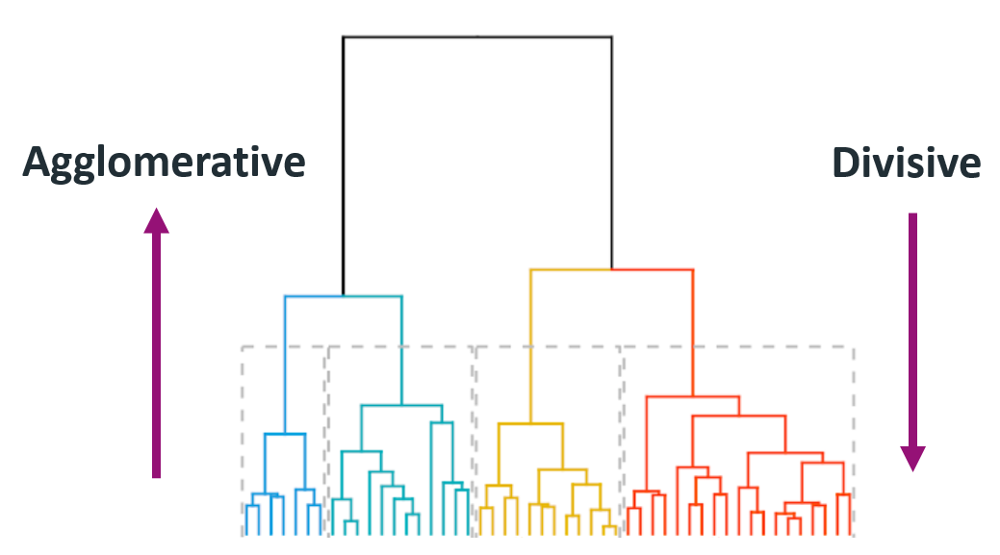

# Day 110 | Agglomerative Hierarchical Clustering | Agglomerative | Divisive Clustering

---

## 🌳 Agglomerative Hierarchical Clustering

**Agglomerative Hierarchical Clustering** is a **bottom-up** clustering technique that builds a hierarchy of clusters by **merging the closest pairs of clusters** iteratively until only one cluster remains.

It is one of the most common forms of **hierarchical clustering**.

---

### 🔁 Algorithm Steps

1. **Start** with each data point as its own cluster (n clusters for n points).
2. **Compute distance** (or similarity) between all pairs of clusters.
3. **Merge** the two closest clusters.
4. **Update** the distance matrix to reflect the merge.
5. Repeat steps 2–4 until all points are in a single cluster.

---

### 🧮 Distance Metrics

To determine how close two clusters are, different **linkage criteria** can be used:

| Linkage Type | Description                            |
| ------------ | -------------------------------------- |
| **Single**   | Distance between the closest members   |
| **Complete** | Distance between the farthest members  |
| **Average**  | Average distance between all members   |
| **Ward**     | Minimizes the variance within clusters |

---

### 🌐 Dendrogram

A **dendrogram** is a tree-like diagram that records the sequences of merges or splits. It helps you decide **how many clusters to cut** by selecting a threshold.

---

### ✅ Advantages

* No need to pre-specify the number of clusters.
* Works well for discovering nested clusters and data structure.

---

### ❌ Disadvantages

* Computationally expensive: $O(n^3)$ time complexity.
* Sensitive to noise and outliers.
* Once merged or split, clusters cannot be undone.

---

### 🔢 Python Example (Using `scikit-learn`)

```python
from sklearn.datasets import make_blobs
from sklearn.cluster import AgglomerativeClustering
import matplotlib.pyplot as plt

# Sample data
X, y = make_blobs(n_samples=150, centers=3, random_state=42)

# Agglomerative Clustering
agglo = AgglomerativeClustering(n_clusters=3, linkage='ward')
labels = agglo.fit_predict(X)

# Plot
plt.scatter(X[:, 0], X[:, 1], c=labels, cmap='rainbow')
plt.title("Agglomerative Hierarchical Clustering")
plt.show()
```

---

### 📊 Visualizing with Dendrogram

```python
from scipy.cluster.hierarchy import dendrogram, linkage

Z = linkage(X, method='ward')
dendrogram(Z)
plt.title("Dendrogram")
plt.xlabel("Data Points")
plt.ylabel("Distance")
plt.show()
```

---


## 🟩Gemini
---

## Agglomerative Hierarchical Clustering: Notes

**Definition:** Agglomerative Hierarchical Clustering is a bottom-up clustering algorithm. It starts by treating each data point as a single cluster and then iteratively merges the closest pairs of clusters until all data points belong to a single cluster or a specified number of clusters is reached.

### ♻Algorithm:

1.  **Initialization:** Each data point is considered as a separate cluster.
2.  **Calculate Proximity:** Compute the distance (or dissimilarity) between all pairs of clusters. This is typically done using a distance metric like Euclidean distance.
3.  **Merge Clusters:** Find the two clusters with the minimum distance between them and merge them into a single new cluster.
4.  **Update Proximity Matrix:** Recalculate the distances between the new cluster and all remaining clusters. The method for this recalculation is determined by the **linkage criterion**.
5.  **Repeat:** Steps 3 and 4 are repeated until only one cluster remains or a predefined stopping condition (e.g., a specific number of clusters) is met.

### 🈯Key Concepts:

* **Dendrogram:** A tree-like structure that visualizes the hierarchy of clusters formed during the agglomerative process. The height at which two clusters are merged indicates their distance.
* **Linkage Criteria:** Determine how the distance between two clusters is calculated. Common linkage methods include:
    * **Single Linkage (Minimum Linkage):** The distance between two clusters is the minimum distance between any two points in the two clusters. Tends to produce long, chain-like clusters.
    * **Complete Linkage (Maximum Linkage):** The distance between two clusters is the maximum distance between any two points in the two clusters. Tends to produce compact clusters.
    * **Average Linkage:** The distance between two clusters is the average of the distances between all pairs of points, one from each cluster. A compromise between single and complete linkage.
    * **Ward's Method:** Merges the two clusters that result in the minimum increase in within-cluster variance. Suitable for roughly spherical clusters of similar size.

### ✅Advantages:

* **No need to specify the number of clusters upfront:** The hierarchical structure allows you to explore different levels of clustering by "cutting" the dendrogram at different heights.
* **Produces a hierarchy of clusters:** This provides a richer understanding of the relationships between data points.
* **Easy to implement and understand conceptually.**
* **Can use different distance metrics:** Allows flexibility based on the nature of the data.
* **Often yields meaningful taxonomies.**
* **Handles outliers relatively well:** Outliers may remain as singleton clusters until late in the merging process.

### 🟥Disadvantages:

* **Computational cost:** The time complexity is typically $O(n^3)$ in the worst case or $O(n^2 \log n)$ with efficient implementations, making it computationally expensive for very large datasets.
* **Greedy approach:** Once a merge is made, it cannot be undone. This can lead to suboptimal clusters if an early merging decision was poor.
* **Sensitive to the choice of linkage criterion:** Different linkage methods can produce significantly different clustering results.
* **Can be difficult to interpret the dendrogram for very large datasets.**
* **Not well-suited for detecting clusters of different densities or non-convex shapes (depending on the linkage).**

### Choosing the Number of Clusters:

* Examine the dendrogram and look for the largest vertical gaps, which suggest natural separations between clusters.
* Use external evaluation metrics (if ground truth is available) or internal metrics (like the silhouette score) after cutting the dendrogram at different levels.
* Consider domain knowledge and the practical implications of different numbers of clusters.

### 💹Applications:

* Taxonomy creation (e.g., in biology).
* Document clustering and organization.
* Customer segmentation.
* Image segmentation.
* Bioinformatics and genomics.

In summary, Agglomerative Hierarchical Clustering is a valuable technique for exploring the inherent structure of data without requiring a predefined number of clusters. The choice of linkage criterion is crucial and the resulting dendrogram provides insightful visualization of the clustering process. However, its computational cost can be a limitation for very large datasets.


## Refrences

[ChatGPT](https://chatgpt.com/)

[Gemini](https://gemini.google.com/app)

## Images


