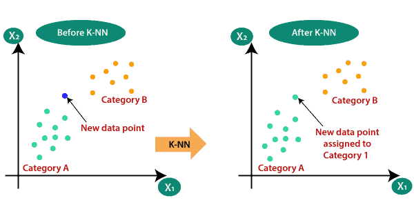
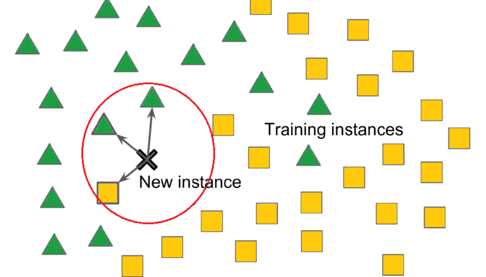

# Day 111 | K Nearest Neighbors | KNN

---

## 📌 K-Nearest Neighbors (KNN)

**K-Nearest Neighbors (KNN)** is a **supervised learning algorithm** used for both **classification** and **regression**. It is a **lazy learning algorithm**, meaning it does not learn a model during training — instead, it memorizes the training data and makes predictions at runtime.

---

### 🚀 How It Works

1. **Choose a value for K** (number of neighbors).
2. To make a prediction for a new point:

   * **Compute the distance** between the new point and all training points (usually Euclidean distance).
   * **Select the K closest** points.
   * **Predict**:

     * **Classification**: Use majority vote of the K neighbors.
     * **Regression**: Take the average of the K neighbors’ values.

---

### 📏 Distance Metrics

Common distance functions:

* **Euclidean distance**:

  $$
  d(x, y) = \sqrt{\sum_{i=1}^{n} (x_i - y_i)^2}
  $$
* **Manhattan distance**
* **Minkowski distance**

---

### ⚙️ KNN Parameters

| Parameter     | Description                         |
| ------------- | ----------------------------------- |
| `n_neighbors` | Number of neighbors (K)             |
| `metric`      | Distance metric (e.g., 'euclidean') |
| `weights`     | 'uniform' (equal) or 'distance'     |

---

### ✅ Advantages

* Simple and intuitive.
* No training phase.
* Works well with small datasets.

---

### ❌ Disadvantages

* Slow for large datasets (needs distance calculation for all points).
* Sensitive to irrelevant or scaled features.
* Poor performance on imbalanced datasets.

---

### 🧪 Python Example (Scikit-learn)

```python
from sklearn.neighbors import KNeighborsClassifier
from sklearn.datasets import load_iris
from sklearn.model_selection import train_test_split

# Load data
X, y = load_iris(return_X_y=True)
X_train, X_test, y_train, y_test = train_test_split(X, y, test_size=0.3)

# Train KNN
knn = KNeighborsClassifier(n_neighbors=5)
knn.fit(X_train, y_train)

# Predict
y_pred = knn.predict(X_test)
```

---

### 📊 Choosing the Best K

* Use **cross-validation** to find the optimal value of K.
* A low K can lead to overfitting; a high K may underfit.

---


## Gemini

## K-Nearest Neighbors (KNN): Notes

**Definition:** K-Nearest Neighbors (KNN) is a simple, non-parametric supervised learning algorithm used for both **classification** and **regression** tasks. It works by finding the $k$ closest data points (neighbors) in the training dataset to a new, unlabeled data point and making a prediction based on the labels or values of these neighbors.

**Core Idea:** Similar data points tend to be close to each other in the feature space.

### Algorithm:

1.  **Choose the number of neighbors (k):** This is a crucial hyperparameter.
2.  **Calculate Distance:** For a new, unlabeled data point, calculate the distance between it and all other data points in the training dataset. Common distance metrics include:
    * **Euclidean Distance:** The straight-line distance between two points.
        $\qquad d(p, q) = \sqrt{\sum_{i=1}^{n} (p_i - q_i)^2}$
    * **Manhattan Distance:** The sum of the absolute differences of their coordinates.
        $\qquad d(p, q) = \sum_{i=1}^{n} |p_i - q_i|$
    * **Minkowski Distance:** A generalized form of Euclidean and Manhattan distance (where $p=2$ is Euclidean and $p=1$ is Manhattan).
        $\qquad d(p, q) = \left( \sum_{i=1}^{n} |p_i - q_i|^p \right)^{1/p}$
    * **Cosine Similarity:** Measures the cosine of the angle between two vectors, useful for text and high-dimensional data. (Note: KNN often uses distance, so cosine distance, $1 - \text{cosine similarity}$, might be used).
    * Other distance metrics like Chebyshev, Hamming, etc., can be used depending on the data type and problem.
3.  **Find the k-Nearest Neighbors:** Select the $k$ training data points that have the smallest distances to the new data point.
4.  **Make a Prediction:**
    * **Classification:** Assign the new data point to the class that is most frequent (majority class) among its $k$ nearest neighbors.
    * **Regression:** Predict the value of the new data point by calculating the average (or weighted average) of the target values of its $k$ nearest neighbors.

### Key Concepts:

* **Non-parametric:** KNN makes no assumptions about the underlying data distribution.
* **Lazy Learning:** It doesn't learn a model during a training phase but memorizes the training dataset. Computation happens at the prediction time.
* **Distance Metric:** The choice of distance metric significantly impacts the results.
* **Value of k:** A critical hyperparameter that influences the decision boundary and the model's sensitivity to noise.

### Choosing the Value of k:

* **Small k:** Can be sensitive to noise and outliers, potentially leading to overfitting (high variance, low bias).
* **Large k:** Smoothes the decision boundaries, can lead to underfitting (low variance, high bias) by including points from different classes/regions.
* Common techniques for choosing k include:
    * **Cross-validation:** Evaluate the model's performance for different values of k on a validation set.
    * **Elbow method (for error rate):** Plot the error rate against different k values and look for an "elbow" where the rate of decrease slows down.
    * The square root of the number of data points is often used as a rule of thumb.
    * For binary classification, odd values of k can help avoid ties.

### Advantages:

* **Simple to understand and implement.**
* **No explicit training phase.**
* **Can be used for both classification and regression.**
* **Effective for non-linear decision boundaries.**
* **Adapts easily to new data.**
* **Performs well with enough representative data.**
* **Can naturally handle multi-class classification.**

### Disadvantages:

* **Computationally expensive for large datasets** during prediction, as it needs to calculate distances to all training points.
* **High memory requirements** as it stores the entire training dataset.
* **Sensitive to the choice of the distance metric.**
* **Performance degrades with high-dimensional data** (Curse of Dimensionality) as the concept of "nearest" becomes less meaningful.
* **Sensitive to irrelevant features.** Feature scaling is crucial.
* **Can be slow for prediction in large datasets.**
* **Can be biased towards the majority class** in classification problems with imbalanced classes.

### Applications:

* Recommendation systems.
* Image and video recognition.
* Pattern recognition.
* Anomaly detection.
* Medical diagnosis.
* Credit scoring.

### Preprocessing:

* **Feature Scaling:** Essential to ensure that features with larger ranges do not dominate the distance calculations (e.g., standardization or normalization).
* **Handling Missing Values:** Imputation techniques may be needed.
* **Dimensionality Reduction:** Techniques like PCA can be used to reduce the dimensionality of the data, mitigating the curse of dimensionality.

In summary, KNN is a straightforward and versatile algorithm that relies on the similarity of data points for prediction. While easy to grasp, its performance is highly dependent on the choice of $k$, the distance metric, and the quality and dimensionality of the data. Proper preprocessing and hyperparameter tuning are crucial for achieving good results.


## Refrences

[ChatGPT](https://chatgpt.com/)

[Gemini](https://gemini.google.com/app)

## Images



