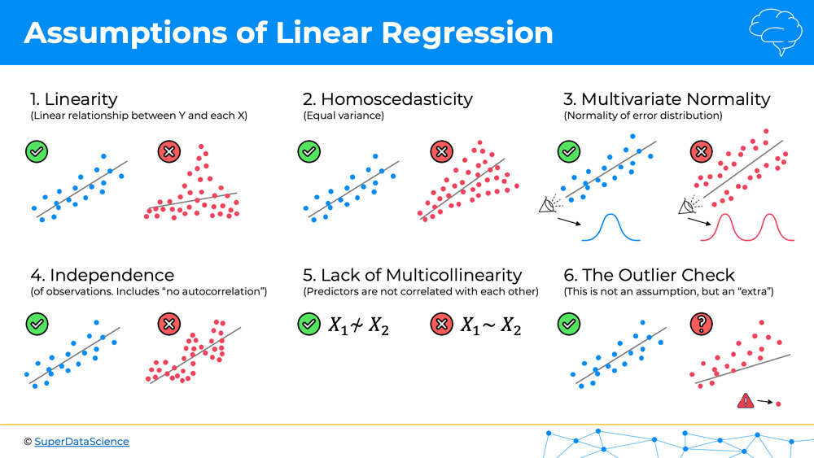
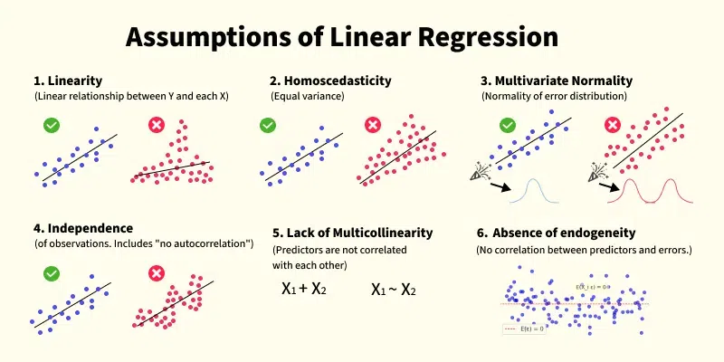

# Day 112 |  Assumptions of Linear Regression
---

## 📌 Assumptions of Linear Regression

Linear regression is a simple yet powerful technique for modeling the relationship between a dependent variable and one or more independent variables. For its results to be valid and reliable, the following key assumptions must hold:

---

### 1. **Linearity**

* The relationship between the independent variables (X) and the dependent variable (Y) is **linear**.
* Mathematically:

  $$
  Y = \beta_0 + \beta_1 X_1 + \beta_2 X_2 + \dots + \beta_n X_n + \varepsilon
  $$

📌 **Check**: Use scatter plots or residual plots.

---

### 2. **Independence of Errors**

* Residuals (errors) should be **independent** of each other.
* Especially important in time series data.

📌 **Check**: Use **Durbin-Watson test** or plot residuals over time.

---

### 3. **Homoscedasticity (Constant Variance)**

* The variance of residuals should be **constant** across all levels of the independent variables.
* No funnel shapes in residual plots.

📌 **Check**: Plot residuals vs. predicted values.

---

### 4. **Normality of Errors**

* The residuals should be **approximately normally distributed**, especially for confidence intervals and hypothesis testing.

📌 **Check**: Use a **Q-Q plot** or histogram of residuals.

---

### 5. **No Multicollinearity (for Multiple Linear Regression)**

* Independent variables should **not be highly correlated** with each other.
* Multicollinearity inflates the variance of coefficients.

📌 **Check**: Use **VIF (Variance Inflation Factor)** — VIF > 10 is problematic.

---

### 6. **No Autocorrelation**

* Especially in time series data: errors should not be correlated with one another.

📌 **Check**: Durbin-Watson statistic (between 1.5 and 2.5 is good).

---

### 🧠 Summary Table

| Assumption           | What to Check                       |
| -------------------- | ----------------------------------- |
| Linearity            | Scatter plots, residuals vs. fitted |
| Independence         | Durbin-Watson test                  |
| Homoscedasticity     | Residual plots                      |
| Normality            | Q-Q plot, histogram                 |
| No Multicollinearity | Correlation matrix, VIF             |
| No Autocorrelation   | Durbin-Watson for time series       |

---


## Code Snippet

> 🔧 We'll cover:\
> ✅ Linearity\
> ✅ Homoscedasticity\
> ✅ Normality of residuals\
> ✅ Independence of errors\
> ✅ Multicollinearity (VIF)\
> ✅ Autocorrelation (Durbin-Watson)

---

### ✅ Sample Code: Linear Regression Assumption Checker

> Python
```python
import numpy as np
import pandas as pd
import matplotlib.pyplot as plt
import seaborn as sns

from sklearn.linear_model import LinearRegression
from sklearn.model_selection import train_test_split
from sklearn.datasets import load_boston
from sklearn.preprocessing import StandardScaler
from statsmodels.stats.outliers_influence import variance_inflation_factor
import statsmodels.api as sm
from scipy import stats

# Load sample data
boston = load_boston()
X = pd.DataFrame(boston.data, columns=boston.feature_names)
y = boston.target

# Standardize the data
scaler = StandardScaler()
X_scaled = pd.DataFrame(scaler.fit_transform(X), columns=X.columns)

# Add constant for statsmodels
X_const = sm.add_constant(X_scaled)

# Fit the model
model = sm.OLS(y, X_const).fit()

# Predictions
y_pred = model.predict(X_const)
residuals = y - y_pred

# 1️⃣ Linearity: Residuals vs Predicted
plt.figure(figsize=(6, 4))
sns.scatterplot(x=y_pred, y=residuals)
plt.axhline(0, color='r', linestyle='--')
plt.title("Residuals vs Predicted (Linearity)")
plt.xlabel("Predicted")
plt.ylabel("Residuals")
plt.show()

# 2️⃣ Homoscedasticity: Same as above (look for constant spread)
# Already visualized

# 3️⃣ Normality of Residuals
# Histogram
sns.histplot(residuals, kde=True)
plt.title("Histogram of Residuals (Normality)")
plt.show()

# Q-Q plot
sm.qqplot(residuals, line='45', fit=True)
plt.title("Q-Q Plot of Residuals")
plt.show()

# 4️⃣ Independence of Errors / Autocorrelation (Durbin-Watson)
dw_stat = sm.stats.stattools.durbin_watson(residuals)
print(f"Durbin-Watson statistic: {dw_stat:.2f}")  # Ideal range: 1.5 to 2.5

# 5️⃣ Multicollinearity (VIF)
vif_data = pd.DataFrame()
vif_data["Feature"] = X_scaled.columns
vif_data["VIF"] = [variance_inflation_factor(X_scaled.values, i)
                   for i in range(X_scaled.shape[1])]
print("\nVIF (Variance Inflation Factor):\n", vif_data)

# 6️⃣ Additional: Shapiro-Wilk test for normality
shapiro_test = stats.shapiro(residuals)
print(f"\nShapiro-Wilk test: p-value = {shapiro_test.pvalue:.4f} (normal if > 0.05)")
```

---

### 📝 Interpretation Guide

| Check              | What to Look For                          |
| ------------------ | ----------------------------------------- |
| Residual Plot      | No clear pattern (random scatter)         |
| Histogram/Q-Q Plot | Bell-shaped, points lie on 45° line       |
| Durbin-Watson      | Value close to **2** (no autocorrelation) |
| VIF                | All values **< 5** (ideal < 10)           |
| Shapiro-Wilk       | p-value > 0.05 → residuals are normal     |

---


## Gemini

## Assumptions of Linear Regression

Linear regression relies on several key assumptions to ensure that the model provides unbiased and efficient estimates. Violations of these assumptions can lead to inaccurate conclusions and unreliable predictions. Here are the main assumptions:

1.  **Linearity:**
    * **Assumption:** The relationship between the dependent variable (the response) and the independent variable(s) (the predictors) is linear. This means that a change in the independent variable is associated with a proportional change in the mean of the dependent variable.
    * **How to Check:** Scatter plots of the dependent variable against each independent variable can help visualize linearity. Residual plots (residuals vs. fitted values) should show a random scatter of points with no discernible pattern (like a curve).

2.  **Independence of Errors (No Autocorrelation):**
    * **Assumption:** The residuals (the differences between the observed and predicted values) are independent of each other. This means that the error for one observation should not influence the error for any other observation.
    * **How to Check:** For time series data, the Durbin-Watson test can detect autocorrelation. For other data, plotting residuals against time or the order of data collection can reveal patterns.

3.  **Homoscedasticity (Constant Variance of Errors):**
    * **Assumption:** The variance of the residuals is constant across all levels of the independent variable(s). In simpler terms, the spread of the errors should be roughly the same for all predicted values.
    * **How to Check:** Residual plots are useful here. The spread of the residuals should be consistent across the range of fitted values. A funnel shape or other patterns indicate heteroscedasticity (non-constant variance). Statistical tests like the Breusch-Pagan or Goldfeld-Quandt test can also be used.

4.  **Normality of Errors:**
    * **Assumption:** The residuals are normally distributed. This assumption is primarily needed for hypothesis testing and constructing confidence intervals for the model parameters. For large sample sizes, the Central Limit Theorem often makes this assumption less critical for the parameter estimates themselves.
    * **How to Check:** Histograms, Q-Q plots (quantile-quantile plots), and statistical tests like the Shapiro-Wilk or Kolmogorov-Smirnov test can be used to assess the normality of the residuals.

5.  **No or Little Multicollinearity:**
    * **Assumption:** The independent variables in a multiple linear regression model are not highly correlated with each other. High multicollinearity can make it difficult to determine the individual effect of each predictor on the response variable and can inflate the standard errors of the coefficients.
    * **How to Check:** Correlation matrices can show the pairwise correlations between independent variables. Variance Inflation Factor (VIF) is a common metric; high VIF values (typically > 5 or 10) suggest multicollinearity.

**Important Notes:**

* **Mean of Residuals:** While often not listed as a formal assumption, a well-fitted linear regression model should have residuals with a mean of zero.
* **No Endogeneity:** This assumption states that the independent variables should not be correlated with the error term. Violation of this assumption can lead to biased coefficient estimates. This is often related to omitted variable bias or simultaneity.
* **Sample Size and Variable Types:** Linear regression typically requires at least two variables that are measured on an interval or ratio scale. A sufficient sample size is also important for reliable results; a common rule of thumb suggests at least 10-20 observations per independent variable.

Understanding and checking these assumptions is crucial for building a valid and reliable linear regression model. If these assumptions are violated, transformations of variables, the use of different modeling techniques, or addressing the underlying data issues might be necessary.


## Refrences

[ChatGPT](https://chatgpt.com/)

[Gemini](https://gemini.google.com/app)

## Images

