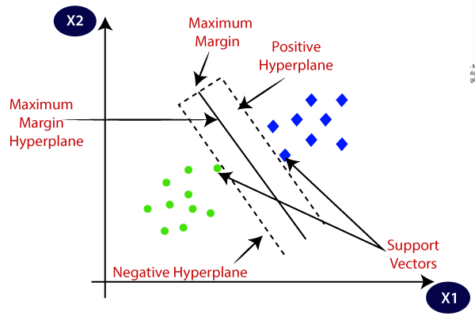
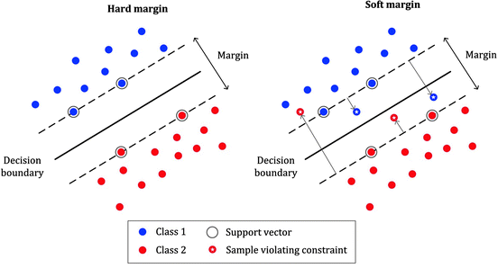

# Day 113 | Support Vector Machine | Part 1 | Geometric Intution

---

## 🧠 Support Vector Machine (SVM)

**Support Vector Machine (SVM)** is a powerful supervised learning algorithm used for both **classification** and **regression**, but it is mostly used for **classification tasks**.

---

### 🔍 Intuition

SVM finds the **best hyperplane** that separates the data points of different classes **with the maximum margin**.

* The **margin** is the distance between the hyperplane and the nearest data point from either class.
* The **support vectors** are the data points that lie closest to the hyperplane and influence its position.

---

### ✳️ Key Concepts

* **Hyperplane**: A decision boundary that separates different classes.
* **Margin**: Distance between the hyperplane and the nearest support vectors.
* **Support Vectors**: Data points that are closest to the hyperplane and define the margin.

---

### 📏 Objective

Maximize the margin:

$$
\text{maximize } \frac{2}{\|\mathbf{w}\|}
\quad \text{subject to } y_i(\mathbf{w}^\top \mathbf{x}_i + b) \geq 1
$$

Where:

* $\mathbf{w}$ = weight vector
* $b$ = bias
* $y_i \in \{-1, +1\}$

---

### 🔁 Non-Linear Classification

When data is not linearly separable, SVM uses the **kernel trick** to transform the data into a higher dimension where a hyperplane can separate the classes.

---

### 🧩 Common Kernels

| Kernel         | Description                      |
| -------------- | -------------------------------- |
| Linear         | For linearly separable data      |
| Polynomial     | Adds polynomial features         |
| RBF (Gaussian) | Maps data to infinite dimensions |
| Sigmoid        | Like a neural net activation     |

---

### ✅ Advantages

* Works well in high-dimensional spaces.
* Effective when number of features > number of samples.
* Robust to overfitting (especially with proper kernel and regularization).

---

### ❌ Disadvantages

* Not suitable for very large datasets (slow).
* Choosing the right kernel and parameters can be tricky.
* Poor performance when classes overlap significantly.

---

### 🔧 SVM in Python (Scikit-learn)

```python
from sklearn import datasets
from sklearn.model_selection import train_test_split
from sklearn.svm import SVC
from sklearn.metrics import classification_report

# Load dataset
X, y = datasets.load_iris(return_X_y=True)
X_train, X_test, y_train, y_test = train_test_split(X, y, test_size=0.3)

# Train SVM
model = SVC(kernel='rbf', C=1.0, gamma='scale')
model.fit(X_train, y_train)

# Predict and evaluate
y_pred = model.predict(X_test)
print(classification_report(y_test, y_pred))
```

---


## Gemni
## Support Vector Machines (SVM)

Support Vector Machines (SVMs) are powerful supervised learning algorithms used for both **classification** and **regression**. They are particularly effective for complex but small- to medium-sized datasets.

### Core Idea:

The fundamental idea behind SVM is to find the optimal **hyperplane** that best separates data points of different classes. This hyperplane should have the **maximum margin**, which is the largest distance between the hyperplane and the nearest data points from each class. These nearest data points are called **support vectors**.

### Key Concepts:

* **Hyperplane:** A decision boundary that separates data points of different classes. In a 2D space, it's a line; in a 3D space, it's a plane; and in higher dimensions, it's a hyperplane.
* **Margin:** The distance between the separating hyperplane and the closest data points (support vectors) from each class. The goal of SVM is to maximize this margin.
* **Support Vectors:** The data points that lie closest to the hyperplane and influence its position and orientation. Only these points are crucial for defining the decision boundary.
* **Kernel Trick:** SVM can efficiently perform non-linear classification by implicitly mapping the input data into a higher-dimensional feature space using a **kernel function**. In this higher-dimensional space, it becomes easier to find a linear hyperplane that separates the classes. Common kernel functions include:
    * **Linear Kernel:** Suitable for linearly separable data.
    * **Polynomial Kernel:** Allows for curved decision boundaries.
    * **Radial Basis Function (RBF) Kernel:** A popular kernel that can handle complex non-linear relationships.
    * **Sigmoid Kernel:** Similar to a neural network's activation function.
* **Hard Margin vs. Soft Margin:**
    * **Hard Margin:** Aims to find a hyperplane that perfectly separates the classes without any misclassifications. This works well for linearly separable data but is sensitive to outliers.
    * **Soft Margin:** Allows for some misclassifications to find a more robust hyperplane that generalizes better to unseen data. This is controlled by a regularization parameter (often denoted as 'C').

### How SVM Works (Classification):

1.  **Map Data:** The input data is mapped to a higher-dimensional feature space (if necessary using a kernel function).
2.  **Find Optimal Hyperplane:** The algorithm searches for the hyperplane that maximizes the margin between the classes in this feature space.
3.  **Define Decision Boundary:** The optimal hyperplane acts as the decision boundary. New data points are classified based on which side of the hyperplane they fall.

### Support Vector Regression (SVR):

SVM principles can also be applied to regression tasks. Instead of finding a hyperplane that separates classes, SVR aims to find a function that approximates the continuous target variable with a certain margin of tolerance (epsilon, ε). The goal is to find a hyperplane such that most of the data points lie within this margin.

### Advantages of SVM:

* Effective in high-dimensional spaces.
* Works well even when the number of dimensions is greater than the number of samples.
* Uses only a subset of training points (support vectors) in the decision function, making it memory efficient.
* Versatile due to the ability to use different kernel functions for non-linear data.
* Robust to outliers (especially with soft margin).
* A principled approach with a strong theoretical foundation.

### Disadvantages of SVM:

* Can be computationally expensive for very large datasets (training time can be high).
* Sensitive to the choice of kernel function and its parameters.
* Difficult to interpret the model, especially with non-linear kernels.
* Doesn't naturally provide probability estimates (though these can be obtained using techniques like Platt scaling).
* Performance can degrade if the data is very noisy and the number of features is much smaller than the number of samples.

### Applications of SVM:

* Image classification
* Text classification (sentiment analysis, spam detection)
* Bioinformatics (protein classification, gene expression analysis)
* Medical diagnosis
* Handwriting recognition
* Financial forecasting
* Anomaly detection

**In summary, Support Vector Machines are a powerful and flexible set of algorithms for classification and regression. Their ability to handle non-linear data through the kernel trick and their focus on maximizing the margin make them a valuable tool in many machine learning applications.**

---

## Refrences

[ChatGPT](https://chatgpt.com/)

[Gemini](https://gemini.google.com/app)

## Images

