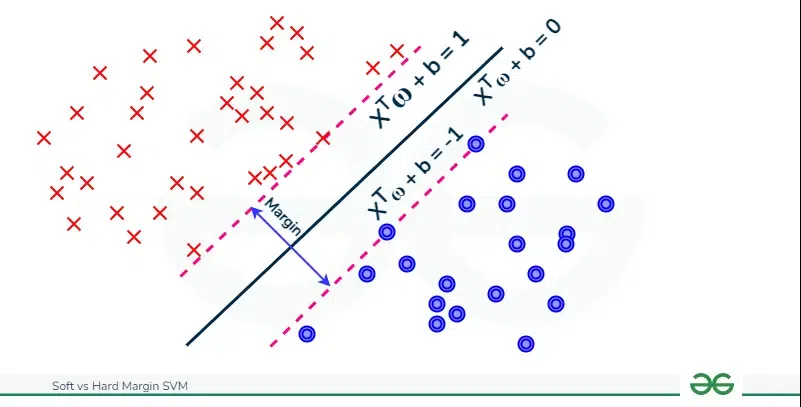

# Day 114 | Support Vector Machine | Part 2 | Hard Margin SVM

---

## 🧠 Hard Margin Support Vector Machine (SVM)

**Hard Margin SVM** is the simplest form of SVM used when the data is **linearly separable** — meaning a perfect hyperplane exists that **separates classes with no errors**.

---

### 🎯 Objective

Find the **maximum margin hyperplane** that separates the two classes **perfectly**.

Let:

* $\mathbf{x}_i \in \mathbb{R}^n$: feature vector
* $y_i \in \{-1, +1\}$: class label
* $\mathbf{w} \in \mathbb{R}^n$: weight vector (normal to the hyperplane)
* $b \in \mathbb{R}$: bias term

The hyperplane is defined as:

$$
\mathbf{w}^\top \mathbf{x} + b = 0
$$

---

### ✳️ Constraints

We want the decision function to correctly classify all training examples:

$$
y_i(\mathbf{w}^\top \mathbf{x}_i + b) \geq 1 \quad \forall i
$$

---

### 🔍 Goal: Maximize Margin

The **margin** is the distance from the hyperplane to the closest data points (support vectors). It is:

$$
\text{Margin} = \frac{2}{\|\mathbf{w}\|}
$$

So maximizing the margin is equivalent to minimizing:

$$
\frac{1}{2} \|\mathbf{w}\|^2
$$

---

### 🧮 Hard SVM Optimization Problem

**Primal form (convex optimization):**

$$
\min_{\mathbf{w}, b} \quad \frac{1}{2} \|\mathbf{w}\|^2 \\
\text{subject to:} \quad y_i(\mathbf{w}^\top \mathbf{x}_i + b) \geq 1
$$

---

### 📐 Geometric Interpretation

* The hyperplane splits the space into two halves.
* Support vectors lie exactly at:

  $$
  \mathbf{w}^\top \mathbf{x}_i + b = \pm1
  $$
* All other points are further away than the margin boundary.

---

### 🧠 Lagrangian Formulation

To solve it, we use **Lagrange multipliers** $\alpha_i \geq 0$ for each constraint.

Lagrangian:

$$
L(\mathbf{w}, b, \boldsymbol{\alpha}) = \frac{1}{2} \|\mathbf{w}\|^2 - \sum_{i=1}^n \alpha_i [y_i(\mathbf{w}^\top \mathbf{x}_i + b) - 1]
$$

Dual problem (after optimization and substitution):

$$
\max_{\alpha} \quad \sum_{i=1}^n \alpha_i - \frac{1}{2} \sum_{i,j=1}^n \alpha_i \alpha_j y_i y_j \mathbf{x}_i^\top \mathbf{x}_j \\
\text{subject to:} \quad \sum_{i=1}^n \alpha_i y_i = 0, \quad \alpha_i \geq 0
$$

Once $\alpha_i$ are found, compute:

* $\mathbf{w} = \sum_i \alpha_i y_i \mathbf{x}_i$
* $b = y_k - \mathbf{w}^\top \mathbf{x}_k$ for any support vector $k$

---

### ⚠️ Limitation of Hard Margin

* **No tolerance** for misclassification.
* Fails if data is **not perfectly linearly separable**.
* In real-world scenarios, **Soft Margin SVM** is used (with slack variables).

---

### ✅ Summary

| Concept    | Equation                                       |
| ---------- | ---------------------------------------------- |
| Hyperplane | $\mathbf{w}^\top \mathbf{x} + b = 0$           |
| Margin     | $\frac{2}{\|\mathbf{w}\|}$                     |
| Constraint | $y_i(\mathbf{w}^\top \mathbf{x}_i + b) \geq 1$ |
| Objective  | $\min \frac{1}{2} \|\mathbf{w}\|^2$            |

---

## Refrences

[ChatGPT](https://chatgpt.com/)

## Images

