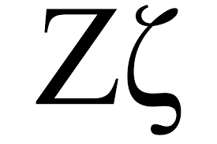
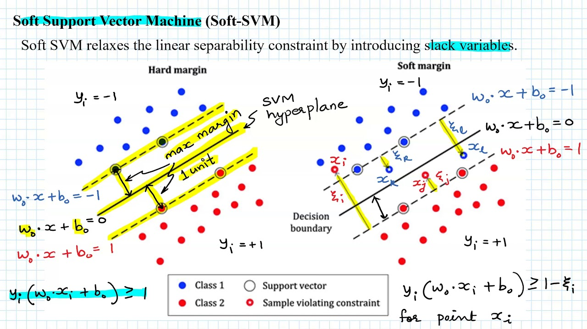
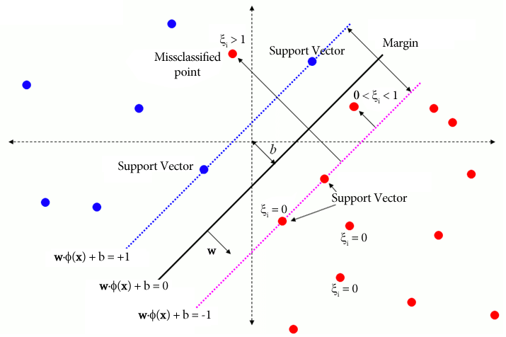

# Day 115 | Support Vector Machine | Part 3 | Soft Margin SVM

---

## 🧠 Soft Margin Support Vector Machine (SVM)

**Soft Margin SVM** is an extension of **Hard Margin SVM** for cases where the data is **not perfectly linearly separable**. It allows some **misclassifications** to improve **generalization** and **robustness**.

---

### 🔍 Why Soft Margin?

Real-world data is often **noisy** or **overlapping**. Hard margin SVM fails because it requires perfect separation.

**Solution:** Introduce **slack variables** $\xi_i \geq 0$ to **allow misclassification**.

---

### 🧮 Mathematical Formulation

Let:

* $\mathbf{x}_i \in \mathbb{R}^n$: features
* $y_i \in \{-1, +1\}$: labels
* $\mathbf{w} \in \mathbb{R}^n$: weight vector
* $b \in \mathbb{R}$: bias
* $\xi_i \geq 0$: slack variable for $i$-th sample

We want:

$$
y_i(\mathbf{w}^\top \mathbf{x}_i + b) \geq 1 - \xi_i
\quad \text{for all } i
$$

Slack $\xi_i$ allows:

* $\xi_i = 0$: correctly classified with margin
* $0 < \xi_i < 1$: inside margin but correct side
* $\xi_i > 1$: misclassified

---

### 🎯 Optimization Objective

$$
\min_{\mathbf{w}, b, \boldsymbol{\xi}} \quad \frac{1}{2} \|\mathbf{w}\|^2 + C \sum_{i=1}^n \xi_i
$$

Subject to:

$$
y_i(\mathbf{w}^\top \mathbf{x}_i + b) \geq 1 - \xi_i \quad \text{and} \quad \xi_i \geq 0
$$

* **$C$** is a regularization parameter that balances:

  * Large margin (small $\|\mathbf{w}\|^2$)
  * Small slack (low error)

---

### 🧠 Lagrangian Formulation

We use Lagrange multipliers $\alpha_i \geq 0$ and $\mu_i \geq 0$ to incorporate constraints:

**Primal Lagrangian:**

$$
L(\mathbf{w}, b, \boldsymbol{\xi}, \boldsymbol{\alpha}, \boldsymbol{\mu}) =
\frac{1}{2} \|\mathbf{w}\|^2 + C \sum_{i=1}^n \xi_i - \sum_{i=1}^n \alpha_i [y_i(\mathbf{w}^\top \mathbf{x}_i + b) - 1 + \xi_i] - \sum_{i=1}^n \mu_i \xi_i
$$

We derive the **dual form** (after applying KKT conditions), which is used in most SVM solvers.

---

### 💡 Decision Function

Once optimized, the final classifier is:

$$
f(\mathbf{x}) = \text{sign} \left( \sum_{i=1}^n \alpha_i y_i \mathbf{x}_i^\top \mathbf{x} + b \right)
$$

* Only **support vectors** (nonzero $\alpha_i$) contribute.

---

### ⚖️ Role of Regularization Parameter $C$

* **Large $C$**: Low tolerance for misclassification → risk of overfitting.
* **Small $C$**: High tolerance for misclassification → better generalization.

---

### 📈 Graphical View

In a 2D plane:

* The soft margin boundary allows some points **inside the margin** or **on the wrong side**.
* These points contribute to slack $\xi_i$, controlled by $C$.

---

### ✅ Summary Table

| Element           | Description                                           |
| ----------------- | ----------------------------------------------------- |
| $\xi_i$           | Slack variable (tolerance for errors)                 |
| $C$               | Penalty for misclassification                         |
| Constraints       | $y_i(\mathbf{w}^\top x_i + b) \geq 1 - \xi_i$         |
| Optimization Goal | Minimize $\frac{1}{2} \|\mathbf{w}\|^2 + C\sum \xi_i$ |

---

## Refrences

[ChatGPT](https://chatgpt.com/)

## Images

