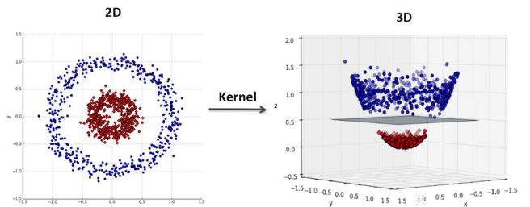

# Day 116 | Kernel Trick in SVM | Part 4

---

## 🧠 Kernel Trick in SVM

The **Kernel Trick** is a powerful technique used in **Support Vector Machines (SVM)** to handle **non-linearly separable data** by implicitly mapping it into a **higher-dimensional space** where it becomes linearly separable — **without ever computing the mapping directly**.

---

### 🤔 Why Use the Kernel Trick?

Many real-world datasets **cannot be separated by a straight line** in their original feature space. However, they **might be separable** in a **higher-dimensional** space.

* **Linear SVM** works well only when data is linearly separable.
* **Kernel SVM** can handle complex boundaries by mapping features implicitly.

---

### 🧮 Mathematical Insight

Suppose we use a transformation $\phi(\mathbf{x})$ that maps input $\mathbf{x} \in \mathbb{R}^n$ to a higher-dimensional feature space.

The SVM dual optimization relies on **dot products**:

$$
K(\mathbf{x}_i, \mathbf{x}_j) = \phi(\mathbf{x}_i)^\top \phi(\mathbf{x}_j)
$$

With the **kernel trick**, we **avoid computing** $\phi(\mathbf{x})$ explicitly. Instead, we use a **kernel function** $K$ that directly computes the dot product in the higher space.

---

### ⚙️ Common Kernel Functions

| Kernel Name    | Formula                                                                    | Use Case                       |
| -------------- | -------------------------------------------------------------------------- | ------------------------------ |
| Linear         | $K(\mathbf{x}, \mathbf{z}) = \mathbf{x}^\top \mathbf{z}$                   | Linearly separable data        |
| Polynomial     | $K(\mathbf{x}, \mathbf{z}) = (\mathbf{x}^\top \mathbf{z} + c)^d$           | Polynomial decision boundaries |
| RBF (Gaussian) | $K(\mathbf{x}, \mathbf{z}) = \exp(-\gamma \|\mathbf{x} - \mathbf{z}\|^2)$  | Highly non-linear data         |
| Sigmoid        | $K(\mathbf{x}, \mathbf{z}) = \tanh(\alpha \mathbf{x}^\top \mathbf{z} + c)$ | Neural network-like mapping    |

---

### 📌 Example: RBF Kernel

The **RBF kernel** maps data into **infinite-dimensional** space:

$$
K(\mathbf{x}, \mathbf{z}) = \exp(-\gamma \|\mathbf{x} - \mathbf{z}\|^2)
$$

* $\gamma$ controls the influence of a single training example.
* Large $\gamma$: more complex, overfits.
* Small $\gamma$: smoother decision boundary.

---

### 🐍 SVM with Kernel in Scikit-learn (Python)

```python
from sklearn.svm import SVC
from sklearn.datasets import make_circles
from sklearn.model_selection import train_test_split
from sklearn.metrics import classification_report

# Toy dataset (non-linearly separable)
X, y = make_circles(n_samples=300, factor=0.5, noise=0.1)

# Train/test split
X_train, X_test, y_train, y_test = train_test_split(X, y)

# SVM with RBF Kernel
model = SVC(kernel='rbf', C=1.0, gamma='scale')
model.fit(X_train, y_train)

# Prediction and Evaluation
y_pred = model.predict(X_test)
print(classification_report(y_test, y_pred))
```

---

### ✅ Summary

* The **kernel trick** allows SVM to build non-linear decision boundaries **efficiently**.
* It avoids explicit high-dimensional computation and relies on smart inner products.
* Choosing the **right kernel** is crucial for performance.

---

## Refrences

[ChatGPT](https://chatgpt.com/)

## Images

