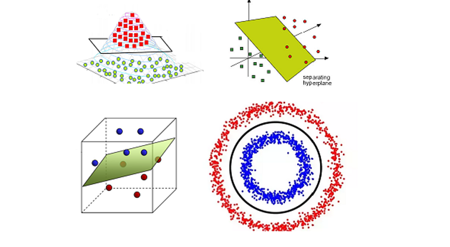

# Day 116 | Kernel Trick in SVM | Part 5 | Hyperparameter

---

## 🐍 Kernel Trick in Scikit-learn (SVM with Parameters)

In `sklearn`, the `SVC` class from `sklearn.svm` supports the kernel trick through the `kernel` parameter. It lets you apply complex, non-linear decision boundaries with minimal effort.

---

### 🔧 Syntax

```python
from sklearn.svm import SVC

model = SVC(kernel='rbf', C=1.0, gamma='scale')
```

---

### 🎯 Main Parameters

| Parameter | Description                                                                                                                 |
| --------- | --------------------------------------------------------------------------------------------------------------------------- |
| `kernel`  | Specifies the kernel type to be used in the algorithm. Supported: `'linear'`, `'poly'`, `'rbf'`, `'sigmoid'`, or a callable |
| `C`       | Regularization parameter. High `C` → less regularization (fits training data better)                                        |
| `gamma`   | Kernel coefficient for `'rbf'`, `'poly'`, and `'sigmoid'`. Controls influence of each training point                        |
| `degree`  | Degree of the polynomial kernel function (only relevant if `kernel='poly'`)                                                 |
| `coef0`   | Independent term in kernel function (used in `'poly'` and `'sigmoid'`)                                                      |

---

### 📚 Examples

#### 1. **Linear Kernel**

```python
model = SVC(kernel='linear', C=1.0)
```

* Suitable for linearly separable data.

---

#### 2. **Polynomial Kernel**

```python
model = SVC(kernel='poly', degree=3, C=1.0, coef0=1)
```

* Maps features to a higher-degree polynomial space.

---

#### 3. **RBF (Gaussian) Kernel**

```python
model = SVC(kernel='rbf', C=1.0, gamma=0.1)
```

* Default and widely used kernel for non-linear problems.

---

#### 4. **Sigmoid Kernel**

```python
model = SVC(kernel='sigmoid', C=1.0, coef0=0.0)
```

* Similar to activation function in neural networks.

---

#### 5. **Custom Kernel (Callable)**

```python
import numpy as np

def custom_kernel(X, Y):
    return np.dot(X, Y.T) ** 2  # Quadratic kernel

model = SVC(kernel=custom_kernel, C=1.0)
```

---

### ✅ Summary Table

| Kernel Type | `kernel` Value | Extra Params      | Use Case                         |
| ----------- | -------------- | ----------------- | -------------------------------- |
| Linear      | `'linear'`     | —                 | Linearly separable data          |
| Polynomial  | `'poly'`       | `degree`, `coef0` | Non-linear polynomial boundaries |
| RBF         | `'rbf'`        | `gamma`           | Complex, radial boundaries       |
| Sigmoid     | `'sigmoid'`    | `coef0`, `gamma`  | Neural-net-like decision regions |
| Custom      | `callable`     | —                 | User-defined similarity measure  |

---


## Refrences

[ChatGPT](https://chatgpt.com/)

## Images
