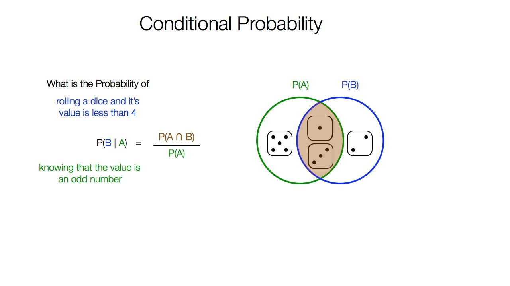
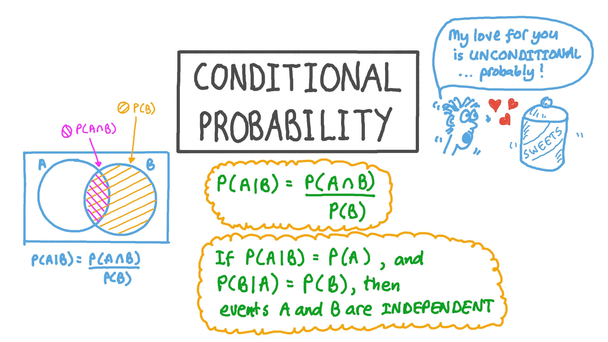

# Day 118 | Naive Bayes Classifier | Part 1 | Conditional Probability

Imagine you have a bag of marbles: 3 red and 2 blue.

**1. Regular Probability:**

* What's the probability of picking a red marble?
   * Total marbles = 5
   * Red marbles = 3
   * Probability (Red) = 3/5

**2. Conditional Probability:**

* Now, imagine someone tells you *before* you pick a marble, "I've already taken out one blue marble."

* **Given this new information**, what's the probability of you picking a red marble *now*?

   * **New situation:**
      * Total marbles remaining = 4 (3 red, 1 blue)
   * The fact that a blue marble was already removed changes the total number of outcomes. We're now looking at a *smaller* set of possibilities.

   * **Probability (Red | Blue removed) = 3/4**

**Why the formula works:**

$P(A|B) = \frac{P(A \cap B)}{P(B)}$

* **$P(A \cap B)$ (Probability of A and B happening):** In our marble example, let A be "picking a red marble" and B be "a blue marble was already removed." The probability of both these things being true in the *original* setup isn't directly what we need for the *new* situation. However, conceptually, we're interested in the scenarios where we end up with a red marble *and* a blue one was removed.

* **$P(B)$ (Probability of B happening):** This is the probability of the "given" event (a blue marble was removed). This helps us focus on the new, reduced sample space.

* **The ratio:** By dividing the probability of both events happening by the probability of the given event, we effectively *restrict our focus* to the world where the given event has already occurred, and then we see how likely our event of interest is within that restricted world.

**Think of it as:**

1.  **Something happened (Event B).** This changes the rules of the game or what's possible.
2.  **Now, within this new reality where B is true, what's the chance of something else (Event A) happening?**

Conditional probability is crucial in machine learning for things like:

* **Naive Bayes:** Calculating the probability of a class given the observed features.
* **Sequential Models (like HMMs):** Predicting the next state based on the current state.
* **Risk Assessment:** Estimating the probability of an event (e.g., loan default) given certain conditions (e.g., credit score).

## Refrences

[Gemini](https://gemini.google.com/app)
<!-- [ChatGPT](https://chatgpt.com/) -->

## Images

