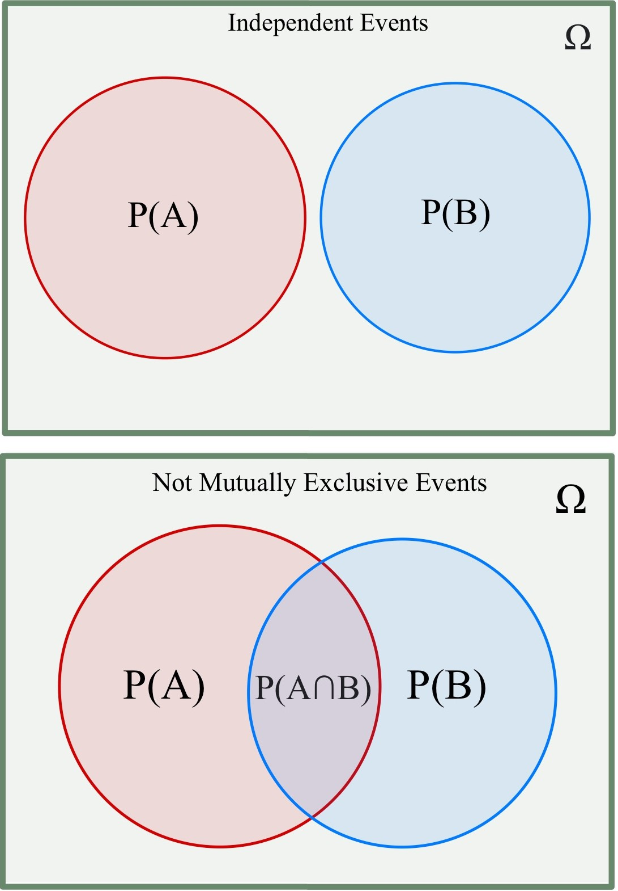
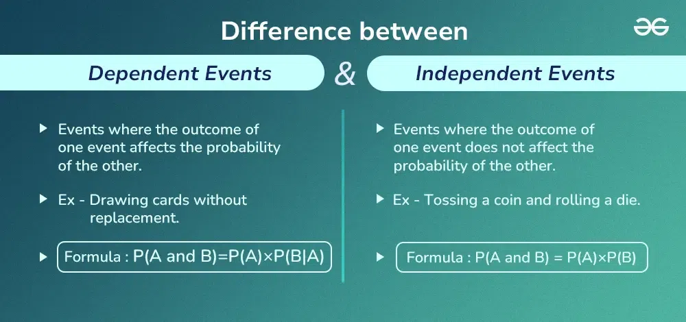
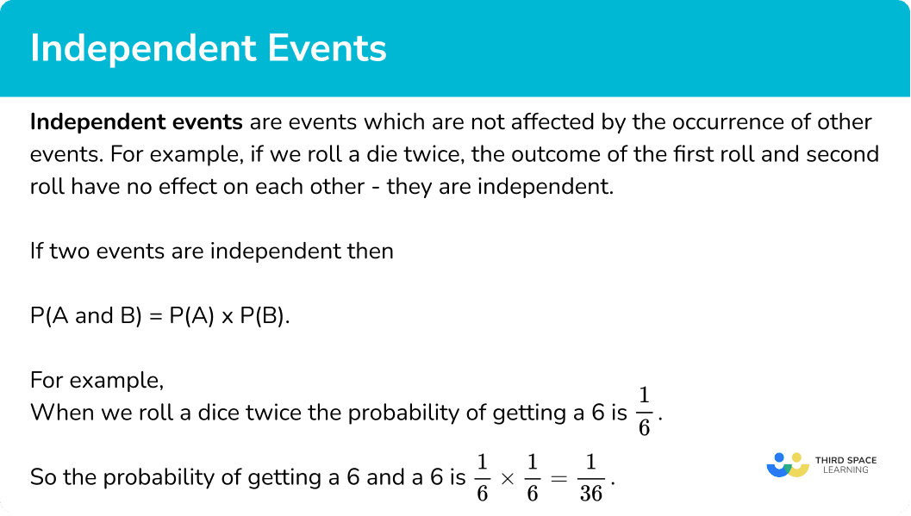

# Day 119 | Naive Bayes Classifier | Part 2 | Independent Event

---

## 🎲 Independent Events (Probability)

### 📌 Definition

Two events $A$ and $B$ are called **independent** if the occurrence of one **does not affect** the probability of the other.

### 🧮 Mathematical Definition

Events $A$ and $B$ are independent **if and only if**:

$$
P(A \cap B) = P(A) \cdot P(B)
$$

This means:

* The probability of both events occurring together equals the product of their individual probabilities.

---

### 🔁 Generalization

For **multiple events** $A_1, A_2, \dots, A_n$, they are **mutually independent** if:

$$
P(A_i \cap A_j) = P(A_i) \cdot P(A_j) \quad \text{for all } i \ne j
$$

and this extends to **all subsets** of events.

---

### 📊 Example

* Tossing two fair coins:

  * Let $A$: Head on the first coin → $P(A) = 0.5$
  * Let $B$: Head on the second coin → $P(B) = 0.5$
  * Then $P(A \cap B) = 0.5 \cdot 0.5 = 0.25$

Since $P(A \cap B) = P(A) \cdot P(B)$, events $A$ and $B$ are **independent**.

---

### ❗ Important Notes

* **Independence ≠ Mutual exclusivity**. In fact, **mutually exclusive** events are never independent unless one has zero probability.
* **Independence is crucial** in many ML algorithms (e.g., Naive Bayes assumes feature independence).

---

## Refrences

<!-- [Gemini](https://gemini.google.com/app) -->
[ChatGPT](https://chatgpt.com/)

## Images

