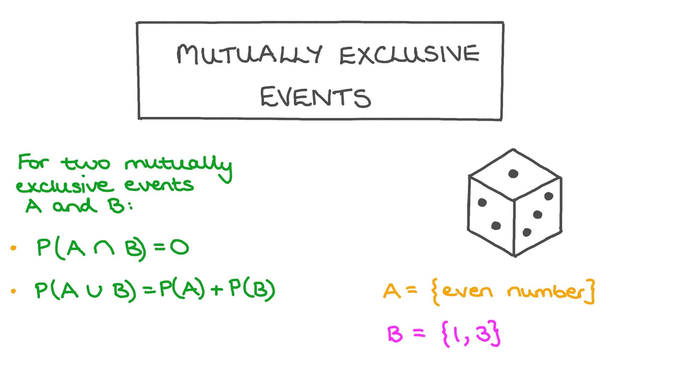
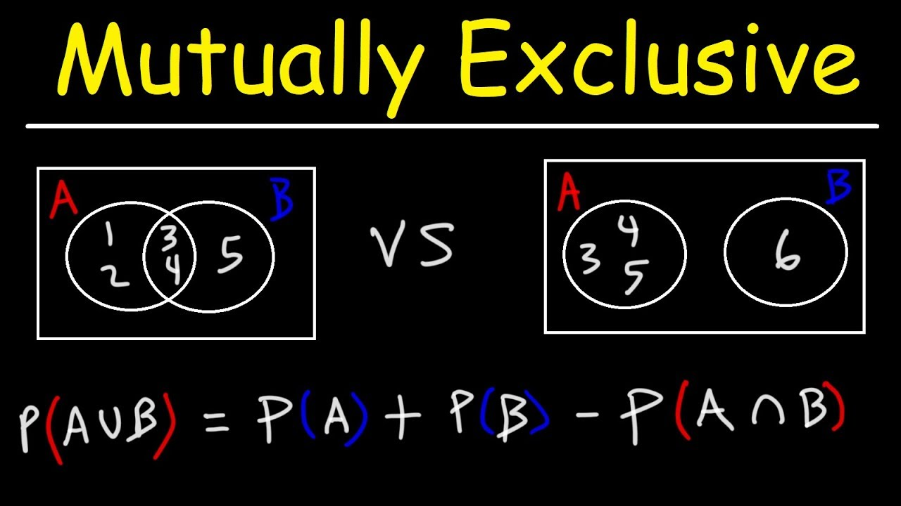

# Day 120 | Naive Bayes Classifier | Part 3 | Mutually Exclusive Events

---

## 🚫 Mutually Exclusive Events

### 📌 Definition

Two events $A$ and $B$ are called **mutually exclusive** (or **disjoint**) if **they cannot occur at the same time**.

$$
A \cap B = \emptyset
$$

This means:

$$
P(A \cap B) = 0
$$

---

### 🧮 Addition Rule for Mutually Exclusive Events

If $A$ and $B$ are mutually exclusive:

$$
P(A \cup B) = P(A) + P(B)
$$

This simplifies the general addition rule by removing the intersection term.

---

### 🎲 Example

* Let $A$: rolling a 2 on a die → $P(A) = \frac{1}{6}$
* Let $B$: rolling a 5 → $P(B) = \frac{1}{6}$

Since a single die roll cannot result in both 2 and 5 simultaneously:

$$
P(A \cap B) = 0 \Rightarrow A \text{ and } B \text{ are mutually exclusive}
$$

$$
P(A \cup B) = \frac{1}{6} + \frac{1}{6} = \frac{1}{3}
$$

---

### ❗ Important Notes

* **Mutually exclusive ≠ Independent**
  If events are mutually exclusive and both have non-zero probability, they **cannot be independent** because the occurrence of one prevents the other.

* Example conflict:

  * $P(A) > 0, P(B) > 0$, but $P(A \cap B) = 0 \Rightarrow$ Not Independent.

---

### ✅ Summary

| Property                | Independent Events              | Mutually Exclusive Events |
| ----------------------- | ------------------------------- | ------------------------- |
| Can occur together?     | Yes                             | No                        |
| Formula                 | $P(A \cap B) = P(A) \cdot P(B)$ | $P(A \cap B) = 0$         |
| Relation between events | No effect on each other         | One excludes the other    |

---

## Refrences

<!-- [Gemini](https://gemini.google.com/app) -->
[ChatGPT](https://chatgpt.com/)

## Images

