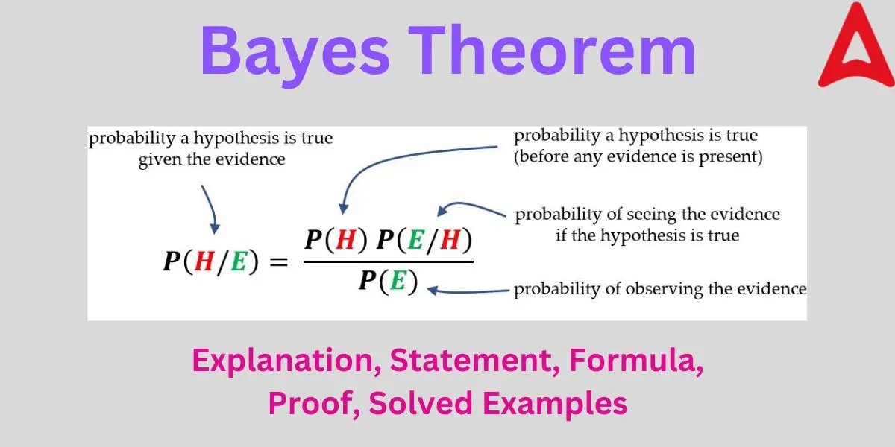

# Day 122 | Naive Bayes Classifier | Part 5 | Bayes Theorem | Example

---

## 🧪 Real-Life Example: Medical Test for a Disease

### 🩺 Scenario

You go for a medical test for a rare disease. The test is:

* **99% sensitive**: If you have the disease, it gives a positive result 99% of the time.
* **95% specific**: If you don't have the disease, it gives a negative result 95% of the time.
* The disease is **rare**, affecting **1 in 1,000 people** (0.1%).

Now you test **positive**. What is the **probability that you actually have the disease**?

---

### 🎯 Goal

Find:

$$
P(\text{Disease} \mid \text{Positive})
$$

---

### 🧮 Given Probabilities

* $P(\text{Disease}) = 0.001$
* $P(\text{No Disease}) = 1 - 0.001 = 0.999$
* $P(\text{Positive} \mid \text{Disease}) = 0.99$
* $P(\text{Positive} \mid \text{No Disease}) = 1 - 0.95 = 0.05$

---

### 🔁 Apply Bayes’ Theorem

$$
P(\text{Disease} \mid \text{Positive}) = \frac{P(\text{Positive} \mid \text{Disease}) \cdot P(\text{Disease})}{P(\text{Positive})}
$$

We calculate $P(\text{Positive})$ using the **Law of Total Probability**:

$$
P(\text{Positive}) = P(\text{Positive} \mid \text{Disease}) \cdot P(\text{Disease}) + P(\text{Positive} \mid \text{No Disease}) \cdot P(\text{No Disease})
$$

$$
= (0.99 \cdot 0.001) + (0.05 \cdot 0.999) = 0.00099 + 0.04995 = 0.05094
$$

Now plug into Bayes’ Theorem:

$$
P(\text{Disease} \mid \text{Positive}) = \frac{0.99 \cdot 0.001}{0.05094} \approx \frac{0.00099}{0.05094} \approx 0.0194 \approx 1.94\%
$$

---

### ✅ Final Answer:

Despite testing positive, the probability you **actually have the disease is only \~1.94%**.

---

### 🤯 Why So Low?

Because the disease is **very rare**, false positives (from the 5% error rate) dominate the test outcomes. This highlights why **base rates (priors)** are crucial in probabilistic reasoning.

---

### 🐍 Python Code

```python
P_disease = 0.001
P_no_disease = 1 - P_disease
P_pos_given_disease = 0.99
P_pos_given_no_disease = 0.05

P_pos = (P_pos_given_disease * P_disease) + (P_pos_given_no_disease * P_no_disease)

P_disease_given_pos = (P_pos_given_disease * P_disease) / P_pos
print(f"Probability of having the disease given a positive test: {P_disease_given_pos:.4f}")
# Output: 0.0194
```

---


## Refrences

<!-- [Gemini](https://gemini.google.com/app) -->
[ChatGPT](https://chatgpt.com/)

## Images


