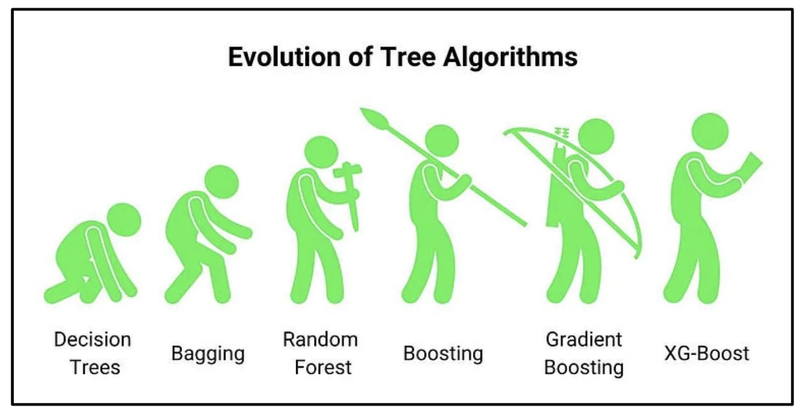

# Day 127 | XGBoost Introduction | Part 1 | History | Performance | Speed | Flexibility

---

## 📘 Introduction to XGBoost

### 🔹 What is XGBoost?

**XGBoost** (Extreme Gradient Boosting) is an optimized and scalable implementation of gradient boosting algorithms. It is one of the most popular and powerful machine learning tools for structured (tabular) data and is widely used in machine learning competitions, including Kaggle.

---

### 📜 History

* **Developed by**: Tianqi Chen (initial release in 2014).
* **Academic backing**: Originally introduced as part of a research paper titled *“XGBoost: A Scalable Tree Boosting System”* presented at KDD 2016.
* **Community Growth**: It rapidly became popular due to its success in winning numerous machine learning competitions and became a go-to choice in many industrial ML pipelines.

---

### 🎯 Why XGBoost Was Built

The primary motivation behind XGBoost was to address the **shortcomings of traditional gradient boosting** in terms of **speed**, **scalability**, and **performance**.

#### 🧠 Developer Concerns & Design Goals

1. **Performance (Accuracy)**

   * Implemented advanced regularization (L1 & L2) to reduce overfitting.
   * Handling Missing Values
   * Sparsity aware split finding
   * Efficiant Split finding
   * Supports both classification and regression tasks with superior accuracy.

2. **Speed**

   * Parallel Processing
   * Optimised Data Structure
   * Cache awareness
   * Out of Core computing
   * Distributed Computing
   * GPU Computing
   * Utilizes system optimization techniques like cache awareness and out-of-core computation.
   * Implements **parallelized tree construction**, unlike traditional boosting which is sequential.

3. **Scalability**

   * Can efficiently handle **large datasets** using distributed computing and sparsity-aware learning.

4. **Flexibility**

   * Cross Platform
   * Multiple Language Support
   * Integration with other library
   * Allows customization via user-defined objective and evaluation functions.
   * Supports linear models and tree learning algorithms.

5. **Robustness**

   * Handles missing values gracefully.
   * Offers early stopping, cross-validation, and extensive hyperparameter tuning.

---

### 🔄 Comparison with Other Boosting Libraries

| Library              | Main Strengths                             | Language       | Notes                                              |
| -------------------- | ------------------------------------------ | -------------- | -------------------------------------------------- |
| **XGBoost**          | Speed, regularization, scalability         | C++, Python, R | Most widely used                                   |
| **LightGBM**         | Faster training, lower memory usage        | C++, Python, R | Developed by Microsoft, uses leaf-wise tree growth |
| **CatBoost**         | Handles categorical features automatically | C++, Python, R | Developed by Yandex, great for categorical data    |
| **Scikit-learn GBM** | Simple and easy-to-use, slower than others | Python         | Good for small to medium data                      |

---

### 🚀 Summary

XGBoost is a high-performance, scalable machine learning library designed to solve many of the real-world limitations of older gradient boosting methods. Its flexibility, regularization capabilities, and blazing speed have made it a favorite for both academic research and production systems.

---

## Images

