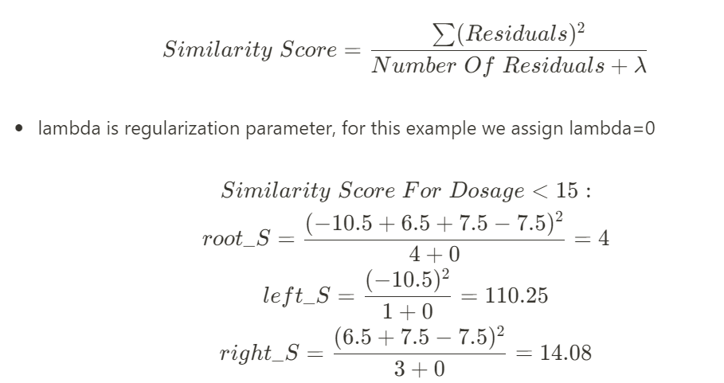

# Day 128 | XGBoost | Part 2 | Regression 


---

## 🔍 How XGBoost Regressor Works

XGBoost is an implementation of **gradient boosting** that improves it in multiple ways. Like any boosting method, it builds an **ensemble of trees**, where each new tree attempts to correct the errors made by the previous trees.

### 🧠 Basic Idea:

For regression, the model minimizes a regularized loss function by **sequentially adding trees** to reduce the prediction error.

---

## 📐 Mathematical Formulation

Suppose we want to predict $y$ from features $X$. We build the model:

$$
\hat{y}_i = \sum_{k=1}^{K} f_k(x_i), \quad f_k \in \mathcal{F}
$$

Where:

* $f_k$: a regression tree
* $\mathcal{F}$: the space of regression trees
* $\hat{y}_i$: prediction for instance $i$

### 🔻 Objective Function:

XGBoost optimizes the following **regularized objective**:

$$
\mathcal{L} = \sum_{i=1}^{n} l(y_i, \hat{y}_i^{(t)}) + \sum_{k=1}^{t} \Omega(f_k)
$$

Where:

* $l$: loss function (e.g., squared error for regression)
* $\Omega(f) = \gamma T + \frac{1}{2} \lambda \sum_{j=1}^{T} w_j^2$: regularization term
* $T$: number of leaves in the tree
* $w_j$: score on leaf $j$

This penalizes complexity (many leaves, large weights), improving generalization.

---

## 🔄 Difference from Traditional Gradient Boosting

| Feature                     | Gradient Boosting (vanilla) | XGBoost                                           |
| --------------------------- | --------------------------- | ------------------------------------------------- |
| **Regularization**          | Not explicitly present      | Uses L1 and L2 regularization                     |
| **Tree Building**           | Greedy and top-down         | Uses second-order approximation (Newton Boosting) |
| **Split Finding**           | Brute force                 | Uses histogram-based, block-aware split search    |
| **Parallelization**         | Sequential                  | Parallel tree construction possible               |
| **Handling Missing Values** | Manual imputation           | Built-in automatic handling                       |
| **Speed**                   | Slower for large data       | Highly optimized and faster                       |

---

## 🌲 How XGBoost Builds Trees (Compared to Vanilla Decision Trees)

### 1. **Gradient & Hessian Calculation**

XGBoost uses a **second-order Taylor approximation** of the loss function:

$$
\mathcal{L}^{(t)} \approx \sum_{i=1}^{n} [g_i f_t(x_i) + \frac{1}{2} h_i f_t^2(x_i)] + \Omega(f_t)
$$

Where:

* $g_i = \partial_{\hat{y}} l(y_i, \hat{y}_i^{(t-1)})$: gradient
* $h_i = \partial^2_{\hat{y}} l(y_i, \hat{y}_i^{(t-1)})$: hessian

This allows better optimization than only using gradients.

---

### 2. **Finding the Best Split**

For each feature, it finds the split that maximizes the **gain**:

$$
\text{Gain} = \frac{1}{2} \left[ \frac{G_L^2}{H_L + \lambda} + \frac{G_R^2}{H_R + \lambda} - \frac{(G_L + G_R)^2}{H_L + H_R + \lambda} \right] - \gamma
$$

Where:

* $G_L, H_L$: sum of gradients/hessians in the left split
* $G_R, H_R$: sum in the right split
* $\lambda$: L2 regularization term
* $\gamma$: penalty for tree complexity

A split is made only if this gain is greater than $\gamma$.

---

### 3. **Leaf Weights Calculation**

After splitting, the **optimal weight** $w_j$ for each leaf is:

$$
w_j = -\frac{G_j}{H_j + \lambda}
$$

Where:

* $G_j$: sum of gradients in the leaf
* $H_j$: sum of hessians in the leaf

---


### 4. Personal Notes
$$
Similarity Score (SS) = \frac{(\sum residul)^2}{No. of Residual + \lambda}
$$

$$
Gain = (SS_L + SS_R) - SS_P
$$

$$
Output = \frac{\sum residual}{No. of Residual + \lambda}
$$

## 🧪 Summary

| Aspect                 | Vanilla Decision Tree          | XGBoost Tree                            |
| ---------------------- | ------------------------------ | --------------------------------------- |
| Loss optimization      | Impurity-based (Gini, MSE)     | Taylor-expanded loss + regularization   |
| Feature selection      | Greedy split based on impurity | Gain based on gradient + hessian        |
| Tree pruning           | Cost-complexity or max-depth   | Regularization + minimal gain threshold |
| Leaf value calculation | Mean of target values          | Based on gradients and hessians         |

---

## ✅ Example in Python

```python
from xgboost import XGBRegressor
from sklearn.datasets import make_regression
from sklearn.model_selection import train_test_split

X, y = make_regression(n_samples=100, n_features=4, noise=0.1)
X_train, X_test, y_train, y_test = train_test_split(X, y)

model = XGBRegressor(objective='reg:squarederror', n_estimators=100)
model.fit(X_train, y_train)
predictions = model.predict(X_test)
```

---

## Refrences

<!-- [Gemini](https://gemini.google.com/app) -->
[ChatGPT](https://chatgpt.com/)

## Images
