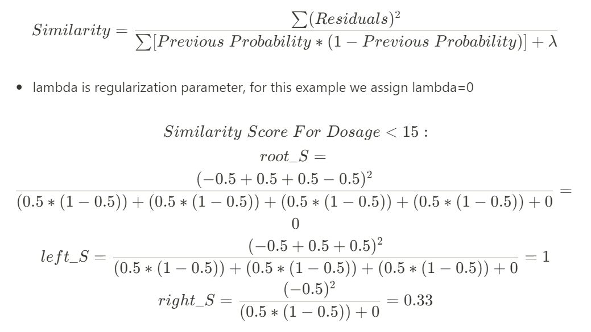
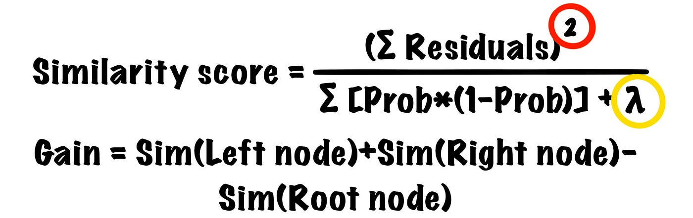

# Day 129 | XGBoost | Part 3 | Classification

---


## 🧠 XGBoost for Classification

XGBoost handles classification problems by applying **gradient boosting to a classification loss**, most commonly **log loss (binary or multi-class)**. It builds an ensemble of decision trees to predict the class label.

Let’s go step by step for **binary classification**, then briefly note multi-class handling.

---

## ⚙️ Step-by-Step XGBoost Classification (Binary)

### 1. **Problem Setup**

Given:

* Input data: $X \in \mathbb{R}^{n \times d}$
* Labels: $y_i \in \{0, 1\}$

Objective: Predict probability $\hat{y}_i = P(y_i = 1 \mid x_i)$

### 2. **Initial Prediction**

Start with a constant prediction (log odds):

$$
\hat{y}_i^{(0)} = 0 \quad \text{(in logit space)}
$$

---

### 3. **Loss Function**

Use **binary logistic loss**:

$$
l(y_i, \hat{y}_i) = -\left[ y_i \log(\sigma(\hat{y}_i)) + (1 - y_i) \log(1 - \sigma(\hat{y}_i)) \right]
$$

Where:

$$
\sigma(\hat{y}) = \frac{1}{1 + e^{-\hat{y}}}
$$

---

### 4. **Gradient & Hessian Calculation**

Compute gradient and hessian for each sample:

Let:

* $p_i = \sigma(\hat{y}_i)$

Then:

* Gradient:

  $$
  g_i = p_i - y_i
  $$

* Hessian:

  $$
  h_i = p_i (1 - p_i)
  $$

---

### 5. **Build Tree Using Gain Function**

XGBoost finds the best split using this **gain function**:

$$
\text{Gain} = \frac{1}{2} \left[ \frac{G_L^2}{H_L + \lambda} + \frac{G_R^2}{H_R + \lambda} - \frac{(G_L + G_R)^2}{H_L + H_R + \lambda} \right] - \gamma
$$

Where:

* $G, H$: sum of gradients and hessians
* $\lambda, \gamma$: regularization parameters

---

### 6. **Calculate Leaf Outputs**

After creating the tree, calculate leaf weights (output value for each leaf):

$$
w_j = -\frac{G_j}{H_j + \lambda}
$$

Where $G_j$, $H_j$ are sums of gradients and hessians for data in leaf $j$.

---

### 7. **Update Predictions**

Add new tree's prediction to previous ones:

$$
\hat{y}_i^{(t)} = \hat{y}_i^{(t-1)} + f_t(x_i)
$$

Apply sigmoid to convert to probability:

$$
P(y_i = 1 \mid x_i) = \sigma(\hat{y}_i^{(t)})
$$

---

### 8. Personal Notes

Regression:
$$
 \frac{\sum Pred}{N}
$$

Classification:
$$
 \log (odds)
$$

Similarity Score:
$$
SS = \frac{(\sum residual)^2}{ N \sum prevProb_i(1-prevProb_i) + \lambda}
$$

Gain:
$$
Gain = (SS_L + SS_R) - SS_P
$$

Output:
$$
Output = \frac{\sum residual}{ N \sum prevProb_i(1-prevProb_i) + \lambda}
$$

## 🧮 Example Formula Flow (1 Tree)

For a single round:

1. Compute $p_i^{(t-1)} = \sigma(\hat{y}_i^{(t-1)})$
2. Compute gradients: $g_i = p_i - y_i$
3. Compute hessians: $h_i = p_i(1 - p_i)$
4. Build tree using gain
5. Predict new output $f_t(x_i)$ from the tree
6. Update logit: $\hat{y}_i^{(t)} = \hat{y}_i^{(t-1)} + f_t(x_i)$

---

## 🧩 For Multi-class Classification

* Use **softmax loss** instead of sigmoid.
* Each tree predicts for one class.
* Number of trees per round = number of classes.

---

## ✅ Python Example (Binary Classification)

```python
from xgboost import XGBClassifier
from sklearn.datasets import make_classification
from sklearn.model_selection import train_test_split

# Sample data
X, y = make_classification(n_samples=1000, n_features=20, random_state=42)
X_train, X_test, y_train, y_test = train_test_split(X, y)

# Train XGBoost
model = XGBClassifier(use_label_encoder=False, eval_metric='logloss')
model.fit(X_train, y_train)

# Predict probabilities and class
proba = model.predict_proba(X_test)
preds = model.predict(X_test)
```
---

## Refrences

<!-- [Gemini](https://gemini.google.com/app) -->
[ChatGPT](https://chatgpt.com/)

## Images




