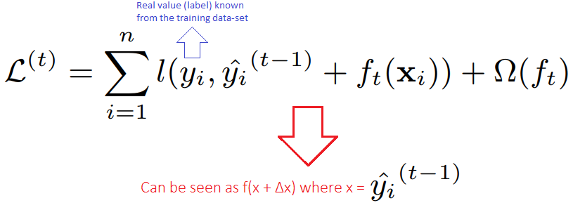
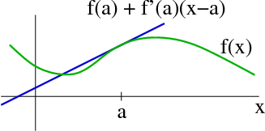
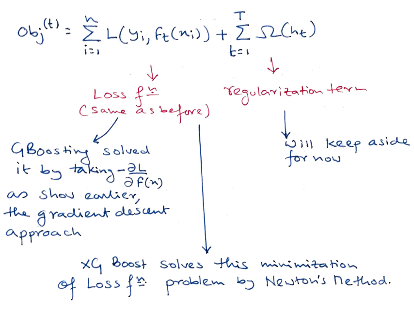
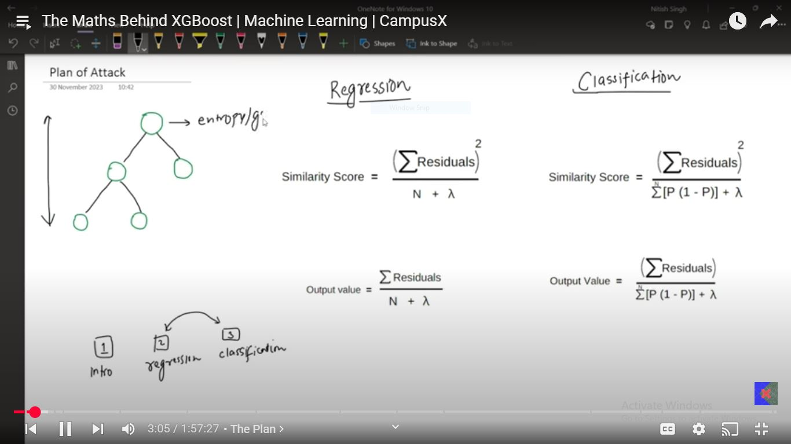

# Day 130 | XGBoost | Part 3 | Total Mathematics

---

## 📘 XGBoost: Total Mathematics

XGBoost is an **optimized implementation** of gradient boosting that builds decision trees by minimizing a regularized objective function using **first and second-order derivatives** (gradient and Hessian).

---

### 🔹 1. **Overall Objective Function**

XGBoost optimizes the following regularized objective:

$$
\mathcal{L}(\phi) = \sum_{i=1}^{n} l(y_i, \hat{y}_i^{(t)}) + \sum_{k=1}^{t} \Omega(f_k)
$$

Where:

* $l(y_i, \hat{y}_i^{(t)})$: loss function (e.g., squared error)
* $\Omega(f) = \gamma T + \frac{1}{2} \lambda \sum_{j=1}^{T} w_j^2$: regularization term
* $f_k$: individual decision trees
* $T$: number of leaves
* $w_j$: leaf weight

---

### 🔹 2. **Taylor Expansion of Loss**

To make optimization efficient, the loss is approximated using a **second-order Taylor expansion**:

$$
l(y_i, \hat{y}_i^{(t)}) \approx l(y_i, \hat{y}_i^{(t-1)}) + g_i f_t(x_i) + \frac{1}{2} h_i f_t^2(x_i)
$$

Where:

* $g_i = \partial_{\hat{y}_i^{(t-1)}} l(y_i, \hat{y}_i^{(t-1)})$ — gradient
* $h_i = \partial^2_{\hat{y}_i^{(t-1)}} l(y_i, \hat{y}_i^{(t-1)})$ — Hessian

So the new objective becomes:

$$
\mathcal{L}^{(t)} \approx \sum_{i=1}^{n} \left[ g_i f_t(x_i) + \frac{1}{2} h_i f_t^2(x_i) \right] + \Omega(f_t)
$$

---

### 🔹 3. **Structure of Decision Tree**

Let:

* $f_t(x) = w_{q(x)}$, where $q: \mathbb{R}^d \to \{1, 2, \dots, T\}$ maps data to a leaf
* $w_j$: score/weight at leaf $j$

Group the loss over leaves:

$$
\mathcal{L}^{(t)} = \sum_{j=1}^{T} \left[ \sum_{i \in I_j} \left( g_i w_j + \frac{1}{2} h_i w_j^2 \right) \right] + \gamma T + \frac{1}{2} \lambda \sum_{j=1}^{T} w_j^2
$$

Simplifying:

$$
\mathcal{L}^{(t)} = \sum_{j=1}^{T} \left[ G_j w_j + \frac{1}{2} (H_j + \lambda) w_j^2 \right] + \gamma T
$$

Where:

* $G_j = \sum_{i \in I_j} g_i$, $H_j = \sum_{i \in I_j} h_i$

---

### 🔹 4. **Optimal Weight for Each Leaf**

To minimize the objective, take derivative w\.r.t $w_j$ and set to 0:

$$
\frac{\partial \mathcal{L}}{\partial w_j} = G_j + (H_j + \lambda) w_j = 0
\quad \Rightarrow \quad
w_j^* = -\frac{G_j}{H_j + \lambda}
$$

---

### 🔹 5. **Optimal Value (Similarity Score)**

Plug $w_j^*$ back in:

$$
\mathcal{L}^{(t)} = -\frac{1}{2} \sum_{j=1}^{T} \frac{G_j^2}{H_j + \lambda} + \gamma T
$$

This is the final score of a tree. The **gain** of a split is measured using this similarity score.

---

### 🔹 6. **Gain from a Split**

For a proposed split into left (L) and right (R):

$$
\text{Gain} = \frac{1}{2} \left[ \frac{G_L^2}{H_L + \lambda} + \frac{G_R^2}{H_R + \lambda} - \frac{(G_L + G_R)^2}{H_L + H_R + \lambda} \right] - \gamma
$$

Only splits with positive gain are considered.

---

## 🎯 Why XGBoost Is Different (and Better) Than Vanilla Gradient Boosting

| Feature                     | Vanilla Gradient Boosting         | XGBoost                                                   |
| --------------------------- | --------------------------------- | --------------------------------------------------------- |
| **Loss Optimization**       | Uses only gradients (first-order) | Uses both **gradients and Hessians** (second-order)       |
| **Tree Growth**             | Greedy split by loss reduction    | **Similarity score-based split** using Gain formula       |
| **Regularization**          | Often lacking or manual           | **Built-in L1/L2** regularization (helps generalization)  |
| **Pruning**                 | Post-pruning via max depth        | **Prunes during split** using min gain $\gamma$           |
| **Speed/Performance**       | Slower, no native parallelism     | **Highly optimized, parallelized**, cache-aware, scalable |
| **Handling Missing Values** | Manual preprocessing              | **Automatically learns optimal missing value direction**  |
| **Sparsity-aware**          | No                                | Yes                                                       |

---

## 🧠 Summary

* XGBoost improves Gradient Boosting by leveraging **second-order Taylor approximation**.
* It computes the best **tree splits using a similarity score**, not just information gain or residuals.
* Regularization and advanced pruning improve **generalization** and **robustness**.
* It's **faster and more scalable** than traditional GBM.

---

## Refrences

<!-- [Gemini](https://gemini.google.com/app) -->
[ChatGPT](https://chatgpt.com/)

## Images

