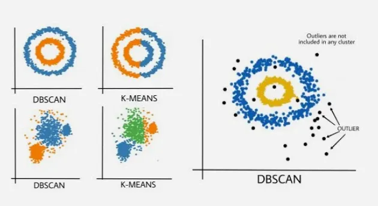
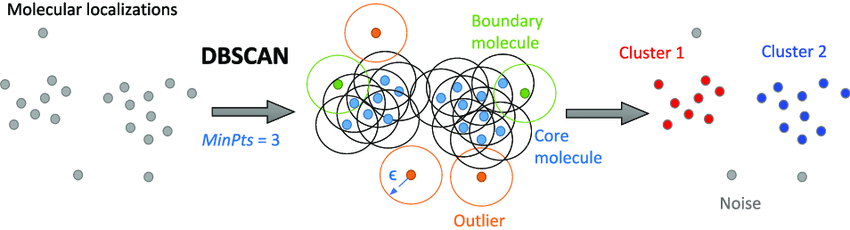
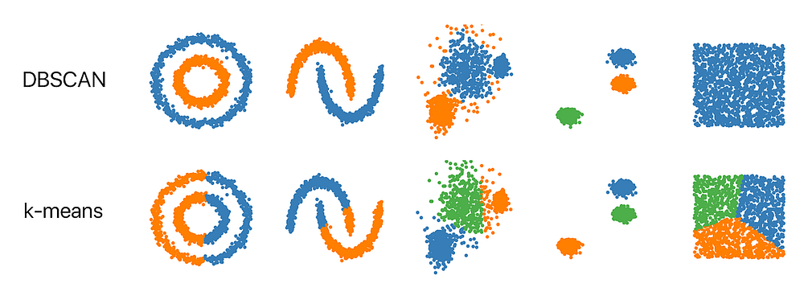

# Day 132 | DBSCAN Clustering Algorithms

---

## 📌 DBSCAN Clustering Algorithm

**DBSCAN** is a **density-based clustering algorithm** that groups together data points that are closely packed (i.e., have many nearby neighbors), and marks points that lie alone in low-density regions as **outliers** or **noise**.

---

### ✅ Key Concepts

* **Epsilon (ε)**: Maximum distance between two points to be considered neighbors.
* **MinPts**: Minimum number of neighbors required to form a dense region (core point).
* **Core Point**: A point with at least `MinPts` within distance `ε`.
* **Border Point**: A point within distance `ε` of a core point but not a core point itself.
* **Noise Point**: A point that is neither a core nor a border point.

---

### 🧠 How DBSCAN Works

1. Choose parameters: **ε** and **MinPts**.
2. For each point:

   * If it has at least `MinPts` neighbors within `ε`, mark it as a **core point**.
   * If it's within ε of a core point but not itself a core, it's a **border point**.
   * Otherwise, it's **noise**.
3. Form a cluster from each **core point**, recursively expanding the cluster to include all density-reachable points.

---

### 📊 Advantages

* Can find **arbitrarily shaped clusters**.
* **No need to specify the number of clusters** in advance.
* Handles **noise and outliers** well.

---

### ⚠️ Limitations

* Choosing optimal **ε** and **MinPts** is not always straightforward.
* Struggles with **varying density clusters**.

---

### 🐍 Python Example using `scikit-learn`

```python
from sklearn.cluster import DBSCAN
from sklearn.datasets import make_moons
import matplotlib.pyplot as plt

# Sample data
X, _ = make_moons(n_samples=300, noise=0.1)

# DBSCAN model
db = DBSCAN(eps=0.2, min_samples=5)
labels = db.fit_predict(X)

# Visualization
plt.scatter(X[:, 0], X[:, 1], c=labels, cmap='plasma')
plt.title("DBSCAN Clustering")
plt.show()
```

---

### 📝 When to Use

* When clusters are of **irregular shape**.
* When you expect **noise or outliers** in your data.
* When the number of clusters is **unknown**.

---

## Gemini
## DBSCAN Clustering Algorithm

**Definition:** DBSCAN (Density-Based Spatial Clustering of Applications with Noise) is an unsupervised machine learning algorithm that groups together points that are closely packed together (forming "dense" regions) while marking as outliers points that lie alone in low-density regions. Unlike K-Means, it does not require specifying the number of clusters beforehand and can find clusters of arbitrary shapes.

**Core Idea:**

DBSCAN defines clusters as areas of high data point density, separated by areas of low data point density. It identifies three types of points:

1.  **Core Point:** A data point that has at least `MinPts` (minimum number of points) within a specified radius `ε` (epsilon) of itself (including the point itself). This signifies a dense region.
2.  **Border Point:** A data point that has fewer than `MinPts` points within its `ε` radius, but is within the `ε` radius of a Core Point. Border points are part of a cluster but are on its "edge."
3.  **Noise Point (Outlier):** A data point that is neither a Core Point nor a Border Point. These points are considered outliers and are not assigned to any cluster.

**Algorithm Steps:**

1.  **Start:** Pick an arbitrary unvisited data point.
2.  **Neighborhood Search:** Retrieve all points within the `ε` distance of the chosen point.
3.  **Core Point Check:**
    * If the number of points in its `ε`-neighborhood is less than `MinPts`, the point is temporarily labeled as **Noise** (it might become a Border Point later).
    * If the number of points is greater than or equal to `MinPts`, the point is labeled as a **Core Point**, and a new cluster is started.
4.  **Cluster Expansion:**
    * Recursively visit all points in the `ε`-neighborhood of the Core Point.
    * For each neighbor:
        * If it's a Core Point, add all its `ε`-neighbors to the current cluster.
        * If it's a Border Point, add it to the current cluster but do not expand from it (as it doesn't have enough neighbors to be a core point itself).
5.  **Iteration:** Continue expanding the cluster until no more points can be added.
6.  **Next Unvisited Point:** Pick another unvisited point from the dataset and repeat the process (steps 2-5). This continues until all points have been visited and assigned a label (either to a cluster or as noise).

**Parameters:**

DBSCAN requires two essential parameters:

1.  **`eps` (ε - Epsilon):** The maximum distance between two points for them to be considered neighbors. This defines the radius of the neighborhood around each point.
2.  **`min_samples` (MinPts):** The minimum number of points required within the `ε` radius for a point to be considered a Core Point.

**Choosing Parameters (`eps` and `min_samples`):**

* **`min_samples`:** A common heuristic is to set `MinPts` to `2 * number_of_dimensions` for datasets with noise. For 2D data, `MinPts` is often set to 4 or more. Larger values lead to more robust clusters but might miss smaller ones.
* **`eps`:** This is more critical and can be challenging to determine. A common method is the **K-distance graph**:
    1.  Calculate the distance from each point to its `k`-th nearest neighbor (where `k = MinPts - 1`).
    2.  Sort these `k`-distances in ascending order.
    3.  Plot the sorted `k`-distances. Look for an "elbow" or a sharp bend in the graph. The `eps` value at this elbow point is often a good choice, as it represents a threshold where points start to become significantly farther apart.

**Advantages:**

* **Does not require specifying the number of clusters upfront.** It discovers the number of clusters based on data density.
* **Can find arbitrarily shaped clusters,** unlike K-Means which assumes spherical clusters.
* **Robust to noise and outliers;** it explicitly identifies and labels noise points, which are not assigned to any cluster.
* Handles clusters of different sizes effectively.

**Disadvantages:**

* **Highly sensitive to the choice of `eps` and `min_samples` parameters.** Small changes can significantly alter the clustering result.
* **Struggles with clusters of varying densities.** A single `eps` value might not work well if some clusters are very dense and others are very sparse, as it might merge sparser clusters with denser ones or mark parts of sparse clusters as noise.
* **Performance degrades with high-dimensional data** (Curse of Dimensionality), as the concept of density becomes less meaningful and distances become less discriminative.
* Can be computationally expensive for very large datasets without efficient indexing structures (e.g., k-d trees, ball trees).

**Applications:**

* **Spatial Data Analysis:** Identifying regions of interest in geographical data (e.g., crime hotspots, traffic patterns).
* **Anomaly/Outlier Detection:** Excellent for finding anomalies in data, such as fraudulent transactions or system failures, by labeling them as noise.
* **Image Processing:** Grouping pixels based on density for object segmentation.
* **Genomics and Proteomics:** Identifying dense regions in biological data.

**DBSCAN vs. K-Means:**

| Feature                | DBSCAN                                      | K-Means                                     |
| :--------------------- | :------------------------------------------ | :------------------------------------------ |
| **Cluster Shape** | Arbitrary (non-spherical)                   | Spherical/convex                            |
| **Number of Clusters** | Not required as input; discovered by algo   | Must be specified upfront ($k$)             |
| **Noise Handling** | Explicitly identifies and labels noise      | Assigns all points to a cluster (sensitive to outliers) |
| **Density Assumption** | Requires uniform density within a cluster   | Assumes roughly equal density/variance       |
| **Parameter Sensitivity**| High sensitivity to `eps` and `min_samples`| Sensitive to initial centroids and $k$      |
| **Computational Cost** | $O(N \log N)$ with indexing, $O(N^2)$ brute-force | $O(k \cdot N \cdot I)$ where $I$ is iterations |

DBSCAN is a powerful and versatile clustering algorithm, especially for datasets where clusters are non-spherical and noise is present. Its effectiveness, however, largely hinges on the careful selection of its two critical parameters.

## Tools
[Visualization_Tools](https://www.naftaliharris.com/blog/visualizing-dbscan-clustering/)

## Images




