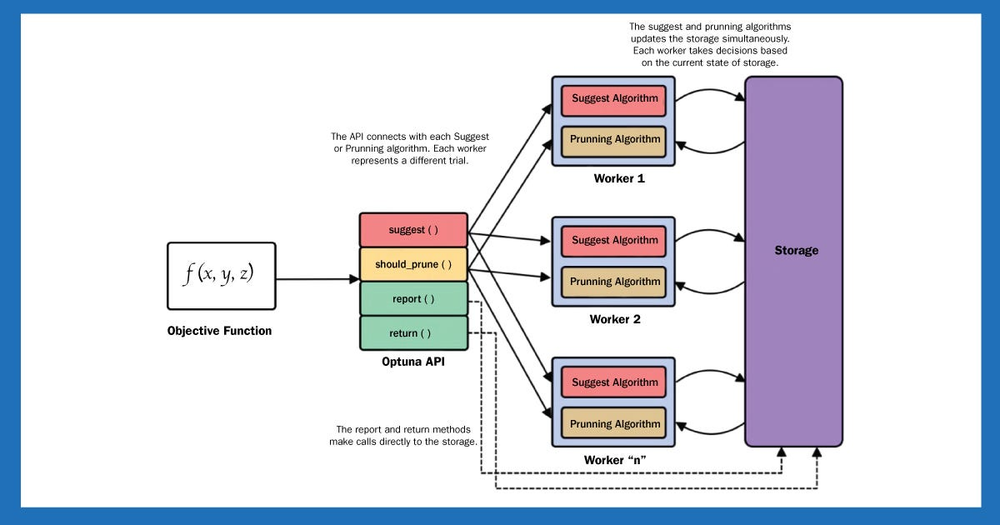
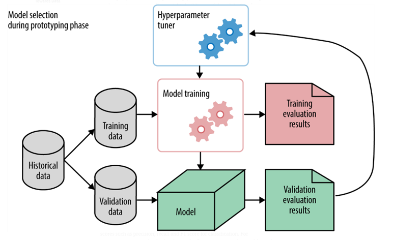

# Day 133 | Hyperparameter Tuning using Optuna | Bayesian Optimization using Optuna

---


## 🎯 Hyperparameter Tuning using Optuna

### 🔹 What is Optuna?

**Optuna** is an open-source hyperparameter optimization framework designed for **automation**, **efficiency**, and **flexibility**. It helps search for the best combination of hyperparameters to optimize machine learning models.

Optuna supports various optimization algorithms, including **Bayesian Optimization**, and works seamlessly with libraries like Scikit-learn, LightGBM, XGBoost, PyTorch, etc.

---

### 🛠️ Key Features of Optuna

* **Define-by-run** interface (dynamic search space)
* Pruning of unpromising trials to save time
* Support for distributed optimization
* Integrated **Bayesian Optimization** (via Tree-structured Parzen Estimator — TPE)

---

### ✅ Basic Workflow

1. **Define the objective function** — takes hyperparameters and returns a score (e.g., accuracy or loss).
2. **Create a study** — an optimization session.
3. **Run optimization** — Optuna suggests parameters and learns which regions of the hyperparameter space perform best.

---

### 🐍 Example: Optuna with Random Forest (Scikit-learn)

```python
import optuna
from sklearn.ensemble import RandomForestClassifier
from sklearn.model_selection import cross_val_score
from sklearn.datasets import load_iris

X, y = load_iris(return_X_y=True)

def objective(trial):
    n_estimators = trial.suggest_int('n_estimators', 10, 200)
    max_depth = trial.suggest_int('max_depth', 2, 32)
    min_samples_split = trial.suggest_int('min_samples_split', 2, 20)

    clf = RandomForestClassifier(
        n_estimators=n_estimators,
        max_depth=max_depth,
        min_samples_split=min_samples_split
    )
    return cross_val_score(clf, X, y, cv=3).mean()

study = optuna.create_study(direction="maximize")
study.optimize(objective, n_trials=50)

print("Best params:", study.best_params)
print("Best score:", study.best_value)
```

---

## 🤖 Bayesian Optimization using Optuna

### 📌 What is Bayesian Optimization?

Bayesian Optimization builds a **probabilistic model** of the objective function and uses it to select the most promising hyperparameters to evaluate next.

In Optuna, this is implemented via the **TPE (Tree-structured Parzen Estimator)** algorithm:

* Models the likelihood of good vs. bad parameter sets
* Chooses new values that are **more likely to improve** the outcome

### 🔍 TPE in Optuna

You can specify TPE explicitly:

```python
from optuna.samplers import TPESampler

study = optuna.create_study(sampler=TPESampler(), direction="maximize")
```

TPE is the **default** sampler in Optuna, so you don’t need to set it unless you want to customize it.

---

### 🔄 How Bayesian Optimization (TPE) Works in Optuna

1. **Model prior trials**: Uses Gaussian distributions to model past trial performance.
2. **Divide trials**: Into good (top X%) and bad.
3. **Estimate likelihoods**: Computes the probability of a value being in the good set.
4. **Choose new hyperparameters**: Based on maximizing expected improvement.

---

### 📊 When to Use Optuna & Bayesian Optimization?

* Complex models with many hyperparameters
* Expensive training processes (where grid/random search is inefficient)
* Need for automatic pruning and fast convergence

---

## ✅ Summary

| Feature               | Optuna                            |
| --------------------- | --------------------------------- |
| Optimization Strategy | Bayesian (TPE), Grid, Random      |
| Speed                 | Fast with pruning support         |
| Flexibility           | Define-by-run, any framework      |
| Best for              | Complex search spaces             |
| Visualizations        | Built-in (`optuna.visualization`) |

---

### 📈 Bonus: Visualization in Optuna

```python
import optuna.visualization as vis

vis.plot_optimization_history(study).show()
vis.plot_param_importances(study).show()
```

---

## Gemini

## Hyperparameter Tuning using Optuna

**Introduction:**
Hyperparameter tuning is the process of finding the optimal set of hyperparameters for a machine learning model that yields the best performance on a given dataset. Unlike model parameters (which are learned during training), hyperparameters are set *before* training and control the learning process itself (e.g., learning rate, number of trees, regularization strength).

**Challenges of Manual Tuning:**

  * **Time-consuming:** Iterative trial and error.
  * **Suboptimal results:** Easy to miss the best combinations.
  * **High-dimensional space:** Many hyperparameters create a vast search space.

**Automated Hyperparameter Optimization:**
Automated methods systematically search for optimal hyperparameters. Optuna is a popular open-source hyperparameter optimization framework that stands out due to its:

  * **Define-by-Run API:** Allows you to dynamically construct the search space for hyperparameters, making it very flexible.
  * **State-of-the-art algorithms:** Employs advanced algorithms, notably Bayesian Optimization, for efficient searching.
  * **Pruning:** Early stopping of unpromising trials.
  * **Visualization:** Tools to easily see the optimization process.

-----

### Bayesian Optimization using Optuna

**Concept of Bayesian Optimization:**
Bayesian Optimization is a sequential strategy for optimizing black-box functions (functions whose internal structure is unknown, like a machine learning model's performance on a validation set). Unlike grid search or random search, which explore the search space blindly or randomly, Bayesian Optimization intelligently selects the next hyperparameters to evaluate based on past results.

**How it Works (Intuition):**

Bayesian Optimization typically involves two main components:

1.  **Probabilistic Model (Surrogate Model):**

      * This model (often a Gaussian Process, but can be Tree-structured Parzen Estimator (TPE) as in Optuna's default) approximates the unknown objective function (e.g., model accuracy).
      * It's built based on the results of past trials (hyperparameter configurations and their corresponding performance).
      * It provides not only a prediction of the objective function's value but also a measure of the **uncertainty** around that prediction.

2.  **Acquisition Function:**

      * This function uses the predictions and uncertainty from the surrogate model to decide the *next* best set of hyperparameters to evaluate.
      * It balances two objectives:
          * **Exploration:** Trying out hyperparameters in regions where the uncertainty is high, hoping to discover entirely new promising areas.
          * **Exploitation:** Trying out hyperparameters in regions where the surrogate model predicts a good objective function value, aiming to refine current best solutions.
      * Common acquisition functions include Expected Improvement (EI), Upper Confidence Bound (UCB), Probability of Improvement (PI).

**Optuna's Implementation of Bayesian Optimization (TPE Algorithm):**

Optuna's default sampler for Bayesian Optimization is the **Tree-structured Parzen Estimator (TPE) algorithm**. TPE works as follows:

  * Instead of directly modeling the objective function, TPE models $P(hyperparameters | value \< threshold)$ and $P(hyperparameters | value \\ge threshold)$, where "threshold" separates good performance from bad performance.
  * It then proposes new hyperparameters that are likely to perform well by sampling from the distribution of "good" hyperparameters and picking the one that also performs poorly under the distribution of "bad" hyperparameters (meaning it's a good candidate for improvement).
  * This approach is particularly efficient for high-dimensional and categorical hyperparameter spaces.

**Steps for Hyperparameter Tuning with Optuna:**

1.  **Define the Objective Function:**

      * This is a Python function that takes a `trial` object as input.
      * Inside the function:
          * You define the search space for each hyperparameter using `trial.suggest_float()`, `trial.suggest_int()`, `trial.suggest_categorical()`, etc.
          * You train your machine learning model using the suggested hyperparameters.
          * You evaluate the model's performance (e.g., accuracy, F1-score) on a validation set.
          * You return the performance metric to be minimized or maximized.
          * Optionally, implement **pruning** (`trial.report()` and `trial.should_prune()`) to stop unpromising trials early.

2.  **Create an Optuna Study:**

      * A `Study` object manages the optimization process, storing results of trials.
      * You specify whether to `minimize` or `maximize` the objective function.

3.  **Run the Optimization:**

      * Call `study.optimize()` with your objective function and the number of trials (`n_trials`).

4.  **Analyze Results:**

      * Access the best trial (`study.best_trial`).
      * Use Optuna's visualization tools (`optuna.visualization.plot_optimization_history`, `plot_param_importances`, etc.) to understand the search process and feature importance.

**Example Code Structure (Conceptual):**

```python
import optuna
from sklearn.model_selection import cross_val_score
from sklearn.ensemble import RandomForestClassifier
from sklearn.datasets import load_iris

# 1. Define the objective function
def objective(trial):
    X, y = load_iris(return_X_y=True)

    # Define hyperparameter search space
    n_estimators = trial.suggest_int('n_estimators', 10, 200)
    max_depth = trial.suggest_int('max_depth', 2, 32)
    criterion = trial.suggest_categorical('criterion', ['gini', 'entropy'])

    # Create and train the model
    classifier = RandomForestClassifier(
        n_estimators=n_estimators,
        max_depth=max_depth,
        criterion=criterion,
        random_state=42
    )

    # Evaluate the model using cross-validation
    score = cross_val_score(classifier, X, y, n_jobs=-1, cv=3).mean()

    return score # Optuna will try to maximize this score by default (or minimize if specified)

# 2. Create an Optuna study
# direction='maximize' means we want to find the hyperparameters that result in the highest score
study = optuna.create_study(direction='maximize')

# 3. Run the optimization
study.optimize(objective, n_trials=50) # Run 50 trials

# 4. Analyze results
print(f"Best trial value: {study.best_value}")
print(f"Best trial hyperparameters: {study.best_params}")

# Optuna also provides visualization functions (requires plotly/matplotlib)
# import optuna.visualization as ov
# fig = ov.plot_optimization_history(study)
# fig.show()
# fig = ov.plot_param_importances(study)
# fig.show()
```

By leveraging Bayesian Optimization, Optuna efficiently navigates the hyperparameter space, often finding better solutions much faster than traditional methods.


## Images

