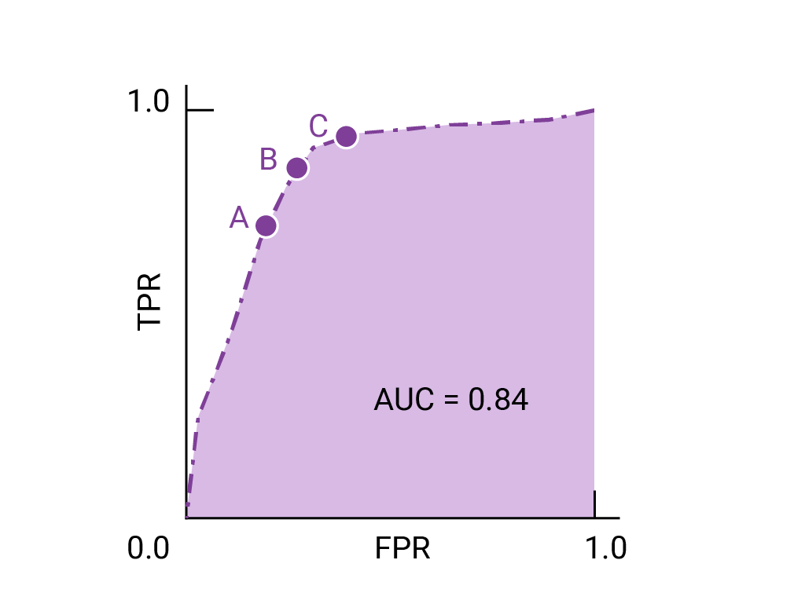

# Day 134 | ROC Curve in Machine Learning | ROC-AUC in Machine Learning Simplified

---

## 🎯 ROC Curve in Machine Learning

### 📌 What is ROC?

**ROC** stands for **Receiver Operating Characteristic**.
It is a **graphical plot** that illustrates the diagnostic ability of a binary classifier system as its discrimination threshold is varied.

---

### 📈 ROC Curve Axes

* **X-axis (False Positive Rate, FPR)**:
  $FPR = \frac{FP}{FP + TN}$
* **Y-axis (True Positive Rate, TPR)** also known as **Recall**:
  $TPR = \frac{TP}{TP + FN}$

The curve plots **TPR vs. FPR** at various threshold settings.

---

### 🧠 Intuition

A perfect classifier would have:

* **FPR = 0**
* **TPR = 1**

Which is the **top-left corner** of the ROC space.

---

## 📊 ROC-AUC (Area Under the Curve)

* **AUC** is the **area under the ROC curve**, and it provides a **single scalar value** summarizing the model’s ability to distinguish between classes.
* Ranges from **0 to 1**:

  * **1.0** = Perfect classifier
  * **0.5** = No skill (random guess)
  * **< 0.5** = Worse than random

---

### 🐍 Python Example using `scikit-learn`

```python
from sklearn.datasets import make_classification
from sklearn.model_selection import train_test_split
from sklearn.linear_model import LogisticRegression
from sklearn.metrics import roc_curve, auc, RocCurveDisplay
import matplotlib.pyplot as plt

# Create sample data
X, y = make_classification(n_samples=1000, n_classes=2, weights=[0.7, 0.3], random_state=42)
X_train, X_test, y_train, y_test = train_test_split(X, y, stratify=y, random_state=42)

# Train model
model = LogisticRegression()
model.fit(X_train, y_train)

# Predict probabilities
y_scores = model.predict_proba(X_test)[:, 1]

# ROC and AUC
fpr, tpr, thresholds = roc_curve(y_test, y_scores)
roc_auc = auc(fpr, tpr)

# Plot
plt.figure()
plt.plot(fpr, tpr, label=f'ROC Curve (AUC = {roc_auc:.2f})')
plt.plot([0, 1], [0, 1], 'k--')  # random guess line
plt.xlabel('False Positive Rate')
plt.ylabel('True Positive Rate')
plt.title('ROC Curve')
plt.legend()
plt.grid()
plt.show()
```

---

## ✅ Why ROC-AUC is Useful

* **Threshold Independent**: Evaluates performance across all thresholds.
* **Class Imbalance Friendly**: More informative than accuracy when dealing with imbalanced datasets.
* Helps to **compare multiple classifiers** effectively.

---

## 📝 Quick Summary

| Term      | Meaning                                                |
| --------- | ------------------------------------------------------ |
| ROC Curve | TPR vs FPR for various thresholds                      |
| AUC       | Area under the ROC curve                               |
| High AUC  | Model distinguishes well between positive and negative |
| AUC = 0.5 | No discrimination — same as random guessing            |

---


## Gemini
For your machine learning notes, here's a simplified explanation of ROC Curve and ROC-AUC:

## ROC Curve in Machine Learning

The **Receiver Operating Characteristic (ROC) Curve** is a graphical plot that illustrates the diagnostic ability of a binary classification model as its **discrimination threshold** is varied.

**What it plots:**

* **X-axis: False Positive Rate (FPR)**
    * FPR = FP / (FP + TN)
    * This is the proportion of actual negative cases that were incorrectly classified as positive (Type I error).
    * Also known as (1 - Specificity).
* **Y-axis: True Positive Rate (TPR)**
    * TPR = TP / (TP + FN)
    * This is the proportion of actual positive cases that were correctly classified as positive (also known as **Sensitivity** or **Recall**).

**How it's built (Simplified):**

1.  A classification model (like Logistic Regression or SVM) typically outputs a *probability* score for each prediction (e.g., probability of being "positive").
2.  Instead of just using a single default threshold (like 0.5) to convert these probabilities into a hard "positive" or "negative" class, the ROC curve considers *all possible* threshold values between 0 and 1.
3.  For each possible threshold:
    * The model's predictions are converted to binary classes.
    * A **Confusion Matrix** is generated, from which TPR and FPR are calculated.
4.  These (FPR, TPR) pairs are then plotted on a graph.

**Interpreting the ROC Curve:**

* **Diagonal Line (from (0,0) to (1,1)):** Represents a classifier that performs no better than random guessing (like flipping a coin). An AUC of 0.5.
* **Ideal Curve (top-left corner):** A perfect classifier would have a TPR of 1 (100% true positives) and an FPR of 0 (0% false positives). Its curve would go straight up from (0,0) to (0,1) and then straight across to (1,1).
* **Good Models:** Curves that "hug" the top-left corner indicate better performance, meaning they achieve a high True Positive Rate while keeping the False Positive Rate low.
* **Trade-off:** The curve visually demonstrates the trade-off between sensitivity (TPR) and specificity (1-FPR). As you increase the threshold, you might reduce false positives but also increase false negatives (reducing TPR).

## ROC-AUC in Machine Learning Simplified

**AUC** stands for **Area Under the (ROC) Curve**. It's a single scalar value that summarizes the overall performance of a binary classification model across *all possible classification thresholds*.

**What it means:**

* **Probability Interpretation:** AUC represents the probability that the model will rank a randomly chosen positive instance higher than a randomly chosen negative instance.
* **Range:** AUC scores range from 0 to 1.
    * **AUC = 1:** Perfect model (separates classes perfectly).
    * **AUC = 0.5:** Model performs no better than random guessing.
    * **AUC < 0.5:** Model performs worse than random (you could reverse its predictions to make it better than random!).

**Why is ROC-AUC useful?**

1.  **Threshold-Independent:** Unlike metrics like accuracy, precision, or recall, AUC evaluates the model's performance regardless of the specific decision threshold chosen. This provides a more holistic view.
2.  **Robust for Imbalanced Data:** It's particularly valuable for **imbalanced datasets** where the number of positive and negative examples is vastly different. Accuracy can be misleading in such cases (e.g., 99% accuracy by always predicting the majority class), but AUC still reflects the model's ability to distinguish between classes.
3.  **Model Comparison:** It provides a single number that can be easily used to compare the overall performance of different classification models. A higher AUC generally indicates a better model.
4.  **Scale-Invariant:** It measures how well predictions are ranked, not their absolute values, making it good for comparing models that might output probabilities on different scales.

**In essence:** The ROC curve shows you the full picture of a classifier's performance across all possible "strictness" levels (thresholds), while the AUC boils that entire picture down to a single, interpretable score.

---

## Note: [This machine learning tutorial repository ends here for now (December 18, 2025)]

## Images

